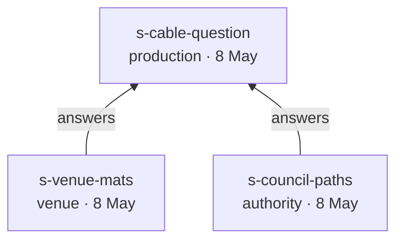

# EventML v0.4 Needs Implementation Plan

> **For agentic workers:** REQUIRED SUB-SKILL: Use superpowers:subagent-driven-development (recommended) or superpowers:executing-plans to implement this plan task-by-task. Steps use checkbox (`- [ ]`) syntax for tracking.

**Goal:** Give L0 an addressable middle level — the `Need` — so that the model can show which stakeholder statement produced nothing and which requirement nobody asked for.

**Architecture:** `Source` is promoted from a reserved key to an entity. `Need` joins it in L0, holding one elementary statement in the stater's own words, anchored to a passage of a source. `Requirement.refines` retargets from a path into the brief document to a `Need` id, which turns `refine` into an ordinary instance reference and lets both ends of the edge be inspected. Two question rules and one review report follow from that. Nothing else in the kernel moves.

**Tech Stack:** Markdown (CommonMark, GitHub-flavoured tables, Mermaid), YAML 1.2. Verification uses ripgrep and one-off Python with PyYAML — neither is a repository dependency, and no script is committed.

**Source spec:** [`docs/superpowers/specs/2026-08-24-eventml-v0.4-needs-design.md`](../specs/2026-08-24-eventml-v0.4-needs-design.md)

**Branch:** `eventml-core-v0.4`, created from `eventml-core-v0.3` at the design commit. `eventml-core-v0.3` carries the `v0.3.0` tag and has not been merged to `main`; whether it goes by pull request is the user's open decision and no task here depends on it.

## Global Constraints

- **No executable code ships.** No validator, no scripts, no schema. `spec/`, `examples/` and `docs/` contain prose and data only.
- **Specification language is English.** Hungarian appears only in `docs/glossary-hu.md`.
- **Version floor is per file and marks capability.** `eventml: "0.4"` is declared by exactly the files using a v0.4 construct: every `brief.yaml` (it carries `needs`), every `requirements.yaml` (its `refines` names a `Need`), and `examples/01-garden-party/decisions.yaml` (its `affects` names a `Need`). Logical and physical files keep `"0.1"`. `examples/03-festival-stage/decisions.yaml` keeps `"0.2"` unless a task below changes its `affects`.
- **Passage offsets are zero-based, end-exclusive, and counted in Unicode code points, not bytes.** `Gellért` is seven characters. They are measured against the *folded* value of `excerpt` — the string YAML produces from a `>-` block, with single spaces at line joins and no trailing newline.
- **Every piece of information has a source.** A gap — an `unknown` value — states no fact and traces to nothing.
- **`refines` holds a list of `Need` ids.** A requirement is assembled from more than one statement. Which of them was the reason and which supplied a figure is read from the requirement's text, not recorded in the edge — the structure carries what a script must check, and meaning stays where a person or an agent judges it.
- **Every requirement names its origin:** `refines`, `derived_from`, or both. Carrying neither is an incomplete record, and question rule 9 reports it.
- **The value machinery does not change.** A `src` still names a source, exactly as in v0.1; `04-uncertainty.md`'s five states, `alternatives` and `ask` are untouched by this release.
- **Released `CHANGELOG.md` sections must not be edited.** `[0.1.0]`, `[0.2.0]` and `[0.3.0]` are historical records. This release lands under `[Unreleased]`.
- **`eventml-core` becomes `0.4.0`; `eventml-lib` stays `0.2.0`** — no library file changes in this release.
- **Adopt, don't invent.** Where a term exists in GDTF, NMOS, IFC, SysML v2, ISO/IEC/IEEE 42010 or ISO/IEC/IEEE 29148, use it and record the source.
- **Commit after every task. Never push** — pushing is the user's decision.

---

## File Structure

| Path | Responsibility |
|---|---|
| `spec/02-metamodel.md` | The `Source` and `Need` entity tables; `Requirement.refines` retyped; the entity count and the reference graph |
| `spec/01-layers.md` | L0 gains entities; the `Source` description leaves; the layer diagram |
| `spec/03-relationships.md` | Seven relations; `refine` retargeted; `trace` extended and named layer-independent; the traversal walk |
| `spec/04-uncertainty.md` | Question rules 8 and 9; the rule tree; ranking; the source coverage report |
| `spec/05-concrete-syntax.md` | The passage reference form; `kind` and `from` extended; version floors |
| `spec/06-sysml-mapping.md` | Two entity rows; the deleted defect sentence; a fifth non-mapping item |
| `spec/07-decisions.md` | `affects` may name a `Need` |
| `spec/00-overview.md` | Two standards rows; the release ordering in one place |
| `examples/01-garden-party/*` | Needs, two new sources, `answers`, retargeted `refines`, README |
| `examples/02-conference-room/*` | Needs, retargeted `refines`, the coverage report walk in the README |
| `examples/03-festival-stage/*` | Needs, the rider source, branching `answers`, retargeted `refines`, README |
| `CLAUDE.md` | The verification rule's wording; version-floor examples |
| `README.md` | Status block, scope, the version-numbered promises |
| `docs/glossary-hu.md` | `Source`, `Need`, `answers`, passage |
| `CHANGELOG.md` | The `[Unreleased]` entry |

Tasks 1–4 define the language. Tasks 5–7 prove it, one example each — the only test this language has. Tasks 8–10 are three separate judgements a reviewer may accept or reject independently: the standards alignment, the removal of version numbers from shipped prose, and the surrounding documents.

---

## Task 0: Branch

**Files:** none

- [ ] **Step 1: Create the branch**

```bash
git checkout -b eventml-core-v0.4
```

Expected: `Switched to a new branch 'eventml-core-v0.4'`

- [ ] **Step 2: Confirm the design record is present**

```bash
git log --oneline -1 -- docs/superpowers/specs/2026-08-24-eventml-v0.4-needs-design.md
```

Expected: one commit, `Finish the v0.4 design the last session could not`.

---

## Task 1: `Source` and `Need` as entities

**Files:**
- Modify: `spec/02-metamodel.md` — §1 prose and Mermaid graph, §3 entity list, new entity sections, `Requirement` table
- Modify: `spec/01-layers.md` — the L0 section and its "Sources" subsection

**Interfaces:**
- Consumes: nothing
- Produces: the attribute names every later task uses — `Need.id`, `Need.text`, `Need.src`, `Need.value`; `Source.id`, `Source.kind`, `Source.date`, `Source.from`, `Source.sender`, `Source.subject`, `Source.excerpt`, `Source.answers`. Task 2 wires the relations, Task 3 the rules, Tasks 5–7 write instances.

- [ ] **Step 1: Add the `Need` section to `spec/02-metamodel.md`**

Insert after the `Requirement` section in §3, before the closing paragraph that introduces `Decision`:

````markdown
### Need

**Purpose.** One elementary unit of information taken from a source, in the stater's own words, anchored
to the passage it came from.

| Attribute | Type | Required | Meaning |
|---|---|---|---|
| `id` | string | yes | Instance identifier, unique within the model |
| `text` | string | yes | The stater's words, quoted rather than paraphrased |
| `src` | passage ref | yes | The source and the passage within it — see `05-concrete-syntax.md` |
| `value` | Value | no | The quantity the statement carries, wrapped as any other value |

**Relations.** References one `Source` through `src`. Referenced by `Requirement.refines` and by
`Decision.affects`. A `Need` names no catalogue type: there is no `NeedDef`, because a stakeholder's
sentence is not an instance of a reusable type.

A need is not only the client's. The venue states distances, an authority states prohibitions, a
performer's rider states what the act needs on stage, and a site visit states what was measured. The word
is ISO/IEC/IEEE 29148's *stakeholder need*, and the standard's separation of stakeholder needs from system
requirements is the same separation EventML draws between L0 and L1.

```yaml
- id: n-welcome-speech
  text: "There'll be a welcome speech around 7"
  src: { id: s-client-brief, exact: "There'll be a welcome speech around 7", start: 93, end: 130 }
```

**`text` is quoted, never paraphrased.** The moment it becomes the modeller's reading of the sentence, the
model loses the thing an argument three weeks later has to be adjudicated against — the same reason
`01-layers.md` gives for a source's `excerpt`.

**A `Need` with no `src` is a modelling error**, not an open question. An elementary statement nobody made
is not a statement, and the fix is to record the source rather than to ask anybody anything. This is the
shape boundary rule 3 has for an unallocated L3 part.

**Where a need carries a quantity it uses the value wrapper unchanged** — `state`, `why`, `src`, `ask`,
`alternatives`, all as defined in `04-uncertainty.md`. Where it carries none, it is text only.

```yaml
- id: n-audience
  text: "about 300 people"
  src: { id: s-client-brief, exact: "about 300 people", start: 36, end: 52 }
  value:
    state: conflicting
    alternatives:
      - { value: 300, src: { id: s-client-brief, exact: "about 300 people", start: 36, end: 52 } }
      - { value: 450, src: { id: s-client-update, exact: "we're now looking at 450" } }
```
````

- [ ] **Step 2: Add the `Source` section to `spec/02-metamodel.md`**

Insert immediately before the `Need` section written in Step 1:

````markdown
### Source

**Purpose.** One piece of material of record — what somebody said or wrote, whole and unmodified.

| Attribute | Type | Required | Meaning |
|---|---|---|---|
| `id` | string | yes | The handle `src:` references. An instance ID: short, lowercase, no dots |
| `kind` | see below | yes | What the material is |
| `date` | date | yes | When the statement was made, ISO 8601 |
| `from` | see below | yes | The party that made it |
| `sender` | string | no | The individual, where which person said it matters |
| `subject` | string | for `email`, `document` and `rider` | The subject line or title |
| `excerpt` | string | yes | The text, verbatim |
| `answers` | list of Source ids | no | The earlier sources this one responds to — see `03-relationships.md` |

`kind` is `email` \| `call` \| `document` \| `site_visit` \| `rider` \| `regulation`.
`from` is `client` \| `venue` \| `production` \| `authority` \| `performer`.

**A source is material of record, not only a communication act.** A tech rider and a wiring regulation are
sources in exactly the sense an email is: somebody stated something, the statement is quoted whole, and
elementary units of information come out of it as `Need`s. A rider is the clearest case ISO/IEC/IEEE 29148
describes — a stakeholder's own list of what the act needs on stage.

**A source is never decomposed.** Granularity lives in the reference: a `Need` names a passage within the
source. Splitting the source itself would need a taxonomy of request, fact and preference whose boundaries
would be argued forever.

**One entry per statement, not per meeting.** A site visit at which three people say three things is three
sources sharing a date, not one source with three sentences in its `excerpt`. The test is whether any value
would ever need to cite one of them alone. `examples/03-festival-stage/brief.yaml` carries the worked case,
where a site manager and a council representative contradict each other on the same afternoon.

**Each fact gets its own key.** The date is not encoded in the `id`, and the person is not appended to the
`src` string. An identifier is a handle, not a record.

**Every source carries text in this release.** A floor plan is a source by the definition above and yields
needs the same way, but anchoring a passage inside a drawing needs a selector no example here exercises —
see `05-concrete-syntax.md`. An unexercised construct is an unproven one, so it waits.

```yaml
- id: s-venue-call
  kind: call
  date: 2026-08-06
  from: venue
  sender: "terrace manager"
  excerpt: >-
    Spoke to the terrace manager. There is an outdoor socket by the service door; he did not know
    what it is rated at and will check. Load-in from 14:00 at the earliest, the restaurant serves
    lunch until 13:30.
```
````

- [ ] **Step 3: Retype `Requirement.refines` in `spec/02-metamodel.md`**

In the `Requirement` attribute table, replace the `refines` row:

```markdown
| `refines` | L0 path | no | The brief element this requirement refines |
```

with:

```markdown
| `refines` | list of Need ids | no | The stakeholder statements this requirement refines |
```

In the same section, replace the sentence beginning "**Relations.** References one `RequirementDef`, optionally one L0 brief element" with:

```markdown
**Relations.** References one `RequirementDef`, any number of L0 `Need`s, and optionally one parent
`Requirement`. A `Requirement` never names a `Part` — the `satisfy` edge is carried by `Part.satisfies`,
pointing upward.
```

And in the worked example at the end of that section, replace `refines: brief.program.welcome_speech` with `refines: n-welcome-speech`.

- [ ] **Step 4: Update §1 and §3 of `spec/02-metamodel.md` for the new count**

Replace "The eleven entities and what each one references." with "The thirteen entities and what each one references."

Replace the sentence "`Decision`, added in v0.2, is the one record that crosses nothing — it names no definition at all, and reaches usages and brief paths directly, at any layer." with:

```markdown
Three records cross nothing and name no definition at all: `Decision`, added in v0.2, which reaches usages
at any layer; and `Source` and `Need`, added in v0.4, which sit in L0 and are named from above.
```

In the Mermaid graph in §1, add to the `model` subgraph, after `Decision`:

```
        Source
        Need
```

and add these edges below the existing ones:

```
    Need -->|"src"| Source
    Requirement -->|"refines"| Need
    Decision -.->|"affects"| Need
```

Open §3 with "Four entities are usages. All of them appear in model files; none of them may appear in a library." unchanged, and replace its closing paragraph — the one beginning "A fifth kind of record, `Decision`" — with:

```markdown
Three further kinds of record live in a project's model files without being usages: they name no `PartDef`
or `RequirementDef` under `def:`. `Decision` can determine elements across every layer in a single edge —
see `07-decisions.md`. `Source` and `Need` sit in L0 and are defined above.
```

- [ ] **Step 5: Rewrite the L0 section of `spec/01-layers.md`**

Replace the L0 "Which entities may appear" line:

```markdown
**Which entities may appear.** Free-form structured values only. No `Part`, no `Connection`, no `Flow` — L0
has no notion of equipment or signal path at all.
```

with:

```markdown
**Which entities may appear.** `Source` and `Need`, defined in `02-metamodel.md`, alongside free-form
structured values. No `Part`, no `Connection`, no `Flow` — L0 has no notion of equipment or signal path at
all.
```

- [ ] **Step 6: Replace the "Sources" subsection of `spec/01-layers.md`**

The attribute table and the "each fact gets its own key" and "one entry per statement" paragraphs moved to
`02-metamodel.md` in Step 2. Replace the whole `### Sources` subsection with:

````markdown
### Sources and needs

L0 carries two entities no other layer has, both defined in `02-metamodel.md`. A `Source` is one piece of
material of record — an email, a call note, a site visit, a rider, a regulation — quoted rather than
paraphrased. A `Need` is one elementary unit of information taken from a source, still in the stater's
words, anchored to the passage it came from.

The two levels are why the chain from a cable back to a sentence can be walked and checked. Sources exist
because `trace` needs somewhere to land; needs exist because `refine` needs something to point at. Without
the middle level nothing could show that a request produced no requirement, or that a requirement came
from no request.

```yaml
brief:
  sources:
    - id: s-client-brief
      kind: email
      date: 2026-08-01
      from: client
      subject: "Garden party, 12 September — quote request"
      excerpt: >-
        Hi — we're doing a garden party for about 300 people at the Gellért terrace on 12 September.
        There'll be a welcome speech around 7, then a live band later.

  needs:
    - id: n-audience
      text: "about 300 people"
      src: { id: s-client-brief, exact: "about 300 people", start: 36, end: 52 }
```

**What is not a need.** Values nobody has stated — whether a terrace is covered, how large an audience area
is — are not statements at all. They are questions about the world carrying a provisional answer, and they
keep the place they have in the brief today. Naming them properly is the work of a later release, and the
seam is deliberate rather than an oversight.
````

- [ ] **Step 7: Verify the file reads correctly end to end**

```bash
grep -n "eleven entities\|thirteen entities\|Free-form structured values only" spec/01-layers.md spec/02-metamodel.md
```

Expected: one hit, `thirteen entities` in `spec/02-metamodel.md`. The other two strings are gone.

- [ ] **Step 8: Commit**

```bash
git add spec/01-layers.md spec/02-metamodel.md
git commit -m "Give L0 the two entities it has been describing in prose"
```

---

## Task 2: The relations

**Files:**
- Modify: `spec/03-relationships.md` — the relation table, the `refine` section, the `trace` section, a new `answer` section, the traversal chain
- Modify: `spec/01-layers.md` — the four-layer Mermaid diagram and the paragraph below it

**Interfaces:**
- Consumes: `Need`, `Source.answers` from Task 1
- Produces: the `answer` relation's stored direction and constraint, which Tasks 5 and 7 write as data

- [ ] **Step 1: Extend the relation table in `spec/03-relationships.md`**

Replace the opening sentence "Six relations connect the four layers and the entities within them." with "Seven relations connect the four layers and the entities within them."

Replace the `refine` row and add an `answer` row so the table reads:

```markdown
| Relation | Direction | Carried by | Meaning |
|---|---|---|---|
| `refine` | L0 → L1 | `Requirement.refines` | A stakeholder statement becomes a requirement |
| `derive` | L1 → L1 | `Requirement.derived_from` | A requirement decomposes into sub-requirements |
| `satisfy` | L2/L3 → L1 | `Part.satisfies` | This block or device meets that requirement |
| `allocate` | L2 → L3 | `Part.allocate` | A logical block is realised by a concrete device |
| `trace` | any → L0 source | `Value.src`, `Need.src` | Which statement, PM decision or default |
| `answer` | L0 → L0 | `Source.answers` | This communication responds to that one |
| `affect` | Decision → any | `Decision.affects` | A decision determined this element |
```

Replace "None of the six is a standalone entity. Five are attributes on the element at the lower end of the edge" with "None of the seven is a standalone entity. Six are attributes on the element at the lower end of the edge".

Add this paragraph after the one ending "`affect` is the one edge on that walk which cannot be followed this way":

```markdown
Two of the seven stay inside one layer. `derive` decomposes a requirement within L1; `answer` connects one
communication to another within L0. Neither crosses a boundary, and neither appears on the layer diagram in
`01-layers.md` for that reason.

`trace` is the one relation that is layer-independent. A value in `physical.yaml` names a source in L0 as
readily as a brief value does, because a source is material of record rather than a design element, and
what caused a choice does not become less relevant three layers down. This is not an exception to boundary
rule 1: the rule forbids a layer from naming elements *below* it, and L0 is above everything.
```

- [ ] **Step 2: Rewrite the `refine` section of `spec/03-relationships.md`**

Replace everything between the `## refine` heading and the `## derive` heading with:

````markdown
**YAML form.** `Requirement.refines`, holding the id of the `Need` it refines.

```yaml
- id: r-speech-terrace
  def: audio.req.speech_intelligibility
  params:
    area: "the terrace seating area"
    audience: 300
  refines: n-welcome-speech
```

**Cardinality.** Many-to-many. A requirement refines any number of needs, and a need may be refined by many
requirements: "then a live band later" produces a requirement for amplification, one for monitoring, and
one for stage power.

A requirement is assembled from more than one statement. Speech intelligibility on the terrace answers the
welcome speech and takes its headcount from the audience count, and both statements are named. Which of
them was the reason the requirement exists and which merely supplied a figure is not recorded, because it
is read from the requirement's own text — and reading a requirement is work for a person or an agent. The
edge carries what a script must check.

**Every requirement names its origin.** It refines a need, it derives from another requirement, or it does
both — `r-coverage-uniformity` in the garden party is a technical consequence of speech intelligibility and
an answer to what the client said about the speech. What cannot happen is neither: a requirement with no
origin edge is not a root, it is an incomplete record, and question rule 9 in `04-uncertainty.md` reports
it.

It is worth being exact about what the gap is, because an earlier draft of this file called it something
else. Nobody asks for a residual current device, and it is tempting to conclude that such a requirement has
no origin. It has one: a wiring regulation, which is a source. A requirement that exists purely on
professional judgement also has one — us, stating the judgement, which `from: production` already records.
So an absent `refines` on a root requirement does not mean the requirement came from nowhere. It means
nobody wrote down where it came from, and the client is being asked to pay for a line the model cannot
justify.
````

- [ ] **Step 3: Extend the `trace` section of `spec/03-relationships.md`**

After the paragraph beginning "**Cardinality.** Every non-`stated` value carries one `src`", insert:

````markdown
**A `Need` carries the same edge, at finer granularity.** Its `src` names not only the source but the
passage within it, using both selectors the W3C Web Annotation Data Model defines for text — the quoted
string and the character offsets. The redundancy is the point: the quotation survives editing and the
offsets stay current, and where the two disagree the break is visible instead of silent.

```yaml
needs:
  - id: n-load-in
    text: "Load-in from 14:00 at the earliest"
    src: { id: s-venue-call, exact: "Load-in from 14:00 at the earliest", start: 96, end: 130 }
```

**A value's `src` still names a source, unchanged from v0.1.** The finer form above is the `Need`'s own
anchor into the passage it was taken from, not a new way of writing a value's provenance.
````

- [ ] **Step 4: Add the `answer` section to `spec/03-relationships.md`**

Insert a new section between `## trace` and `## affect`:

````markdown
## answer

**YAML form.** `Source.answers`, holding the ids of the earlier sources this one responds to.

```yaml
- id: s-client-confirm
  kind: email
  date: 2026-08-12
  from: client
  subject: "Re: Garden party, 12 September — guest numbers"
  answers: [s-audience-query]
  excerpt: >-
    Yes, plan for 450. Sorry for the back and forth — the list is final now.
```

**Cardinality.** One `answers` entry relates exactly one answering source to exactly one answered source. A
source may carry any number of them, and may be named by any number of later sources; most sources carry
none at all. Stating it this way rather than as a many-to-many relation is deliberate: an edge that is a
fact of its own has somewhere to carry an assessment of the answer later, which a set-valued attribute does
not.

**The thread is derived, not stored.** Where two parties answer the same question the thread branches, and
where one message answers two questions it merges. Both fall out of the edges. EventML names no "thread",
just as it stores no requirement tree behind `derived_from`.

**It is not the mail client's reply-to.** A message that is a reply but answers nothing carries no edge —
the relation records that a question was answered, not that a message followed another. And an answer may
arrive by a different channel from the question: we write, the client telephones. No mail thread can
express that, and this is why the edge exists rather than being left to the mail server.

**Our own question is a source.** `from: production` already admits it, and a site visit is such a source
today. Nothing in this relation waits on the machinery that composes an outbound question and tracks its
state; that is a later release.

**It changes no value.** When "Yes, plan for 450" arrives, the audience need stays `conflicting`. Both
statements were made, and which one prevailed belongs to a `Decision` — this is rule 4's exception in
`04-uncertainty.md`, applied to the same facts. Values move only through the state machinery.

**Time.** Every source carries a date, and the answered source's date must not be later than the answering
one's. An edge pointing forward in time is a modelling error rather than a question, and the constraint
rules out cycles. Same-day is ordinary: a question put during a site visit is often answered on the spot,
and `examples/03-festival-stage` carries that case.

**When the edge is absent.** Nothing responded to this source, or nothing it responded to was recorded. A
question we sent that nothing answers is worth surfacing, and becomes derivable from this edge — but the
rule that fires on it belongs with the question lifecycle, in a later release.
````

- [ ] **Step 5: Update the traversal chain at the end of `spec/03-relationships.md`**

In the final Mermaid diagram, replace the `B` node line

```
    B["brief.program#91;1#93;.size<br/>L0 · state: unknown"]
```

with

```
    N["n-band<br/>L0 · Need"]
    S["s-client-brief<br/>L0 · Source"]
```

replace the edge `B -->|"refine"| R` with

```
    S -->|"trace"| N
    N -->|"refine"| R
```

and replace the four-line field-read block below it with:

```
wedge_1            .allocate  → monitor-world        (L3 → L2)
monitor-world      .satisfies → r-monitor-coverage   (L2 → L1)
r-monitor-coverage .refines   → n-band               (L1 → L0)
n-band             .src       → s-client-brief, "then a live band later"
```

Replace the sentence "Standing on site holding a wedge, the walk back to the client's own words is four reads and no searching" with "Standing on site holding a wedge, the walk back to the client's own words is four reads and no searching, and it now ends on the sentence itself rather than on a path into a document".

- [ ] **Step 6: Update the layer diagram in `spec/01-layers.md`**

In the four-layer Mermaid diagram, replace

```
    subgraph L0["L0 Brief — Operational Analysis"]
        B["brief elements · sources<br/>free-form values, no entities"]
    end
```

with

```
    subgraph L0["L0 Brief — Operational Analysis"]
        B["Need · Source<br/>plus free-form values"]
    end
```

and replace the edge label line `R -->|"Requirement.refines"| B` with `R -->|"Requirement.refines"| B` unchanged — the arrow now lands on the `Need` in that box.

In the paragraph below the diagram, replace "Three relations are left off: `derive`, which runs from a requirement to its parent inside L1 and so crosses no boundary, and `trace` and `affect`" with "Four relations are left off: `derive`, which runs inside L1, and `answer`, which runs inside L0, so neither crosses a boundary; and `trace` and `affect`".

- [ ] **Step 7: Verify no brief-path `refines` survives in the specification**

```bash
grep -rn "refines: brief\." spec/
```

Expected: no output.

- [ ] **Step 8: Commit**

```bash
git add spec/01-layers.md spec/03-relationships.md
git commit -m "Point refine at a need, and give the answer relation a home"
```

---

## Task 3: Question rules 8 and 9, and the coverage report

**Files:**
- Modify: `spec/04-uncertainty.md` — §3 opening, the rule tree, two new rule sections, §4 ranking, a new §5

**Interfaces:**
- Consumes: `Need` and the retargeted `refine` from Tasks 1–2
- Produces: rule numbers 8 and 9, cited by the example READMEs in Tasks 5–7

- [ ] **Step 1: Update the §3 opening of `spec/04-uncertainty.md`**

Replace "A question is generated in exactly seven situations." with "A question is generated in exactly nine situations."

Replace "All seven, as one tree. Three of them read a value's state, two read the shape of the traceability graph, one reads a constraint, and one reads a decision — so the first branch is not *which state is this* but *what am I looking at*." with:

```markdown
All nine, as one tree. Three read a value's state, four read the shape of the traceability graph, one reads
a constraint, and one reads a decision — so the first branch is not *which state is this* but *what am I
looking at*.
```

- [ ] **Step 2: Extend the rule tree in `spec/04-uncertainty.md`**

In the Mermaid tree, replace the node line

```
    N -->|"a Requirement or a Part"| G{"which case?"}
```

with

```
    N -->|"a Requirement, a Need or a Part"| G{"which case?"}
```

and add these three branches to the `G` block, after the existing three:

```
    G -->|"a Need no Requirement refines"| R8["Rule 8 — asked for,<br/>nothing refines it"]
    G -->|"a Requirement naming no origin"| R9["Rule 9 — no origin<br/>on record"]
```

- [ ] **Step 3: Add rule 8 to `spec/04-uncertainty.md`**

Insert after the rule 7 section, before `## 4. Ranking`:

````markdown
#### Rule 8 — a `Need` no `Requirement` refines

**Trigger.** A `Need` whose id appears in no requirement's `refines` list.

Somebody stated something and nothing in the design answers it. This is the half of the `refine` edge that
could not be checked before v0.4, and it is the direct answer to a client saying the plan ignores what they
asked for.

**When it fires, one of two things is true**, and the model cannot tell which: either the requirement is
missing, or the statement should not have been taken as a need at all. Both are ordinary work. Deciding
which statements in a source are worth taking is the L0 semantic check in §5 below, made once when somebody
reads the source — which is why this rule needs no way to mark a need as deliberately unanswered.

It is the one rule in this pair that can be put to a stakeholder in their own words, because the need *is*
their words. The wording asks about the world, per §5 below, not about the model.

```yaml
- ask: "You mentioned the restaurant serves lunch until 13:30. Is that something we have to work around?"
  why: "n-lunch is stated and nothing refines it; it may or may not constrain the load-in"
  blocks: 0
```

**Rule 8 and rule 3 are the same question one layer apart.** Rule 3 says a requirement was promised and
nothing delivers it; rule 8 says a statement was made and nothing refines it. Neither is a modelling error:
a model is expected to hold both states while work proceeds.
````

- [ ] **Step 4: Add rule 9 to `spec/04-uncertainty.md`**

Insert immediately after rule 8:

````markdown
#### Rule 9 — a `Requirement` whose origin is not on record

**Trigger.** A `Requirement` carrying neither `refines` nor `derived_from`.

This is the "I never asked for that" case, and it is addressed to the project manager. A requirement with no
recorded origin is a line on the quote the model cannot justify — not because it is unjustified, but
because nobody wrote the justification down.

**One invariant defines it: every requirement names its origin.** It refines a need, it derives from
another requirement, or it does both — a requirement can be a technical consequence of one requirement and
an answer to a stakeholder's statement at the same time. What cannot happen is neither. A requirement with
no origin edge is not a root; it is an incomplete record, and a derived requirement needs no need of its
own because its parent already carries one.

**Every requirement has an origin.** A residual current device comes from a wiring regulation, which is a
source; a spare comes from our own judgement, which `from: production` records as readily as any client
email. So closing this question means recording a source and a need, not inventing a client request. The
rule reports an unrecorded origin rather than an absent one — and it stays a question, because the language
treats incompleteness as data rather than as an error to clear before modelling begins.

```yaml
- ask: "r-house-lights has no recorded origin: nothing in the brief or in our own notes says why the room lights have to be controllable from our position."
  why: "either the requirement is unnecessary, or the reasoning behind it was never written down"
  blocks: 0
```

Rule 9 is rule 6 one layer up, and the symmetry is exact. Rule 6 says a block is delivered that nothing
promised; rule 9 says a requirement is promised that nothing asked for.
````

- [ ] **Step 5: Extend the ranking section of `spec/04-uncertainty.md`**

After the paragraph beginning "Rule 7 sorts to the bottom for the same reason", insert:

```markdown
Rule 8 sorts to the bottom by the same arithmetic and for a different reason. A need nothing refines has no
requirements beneath it, so its `blocks` is 0 — but unlike an unjustified block, an unanswered request
costs nothing until the client reads the quote and everything afterwards. The ranking is honest about what
it measures, which is downstream dependency within the model, and the source coverage report below is where
this class of gap is meant to be read.

Rule 9 is the exception among the rules added in v0.4. A root requirement may have derived children, so its
`blocks` can be greater than zero and it can reach the top of the list — which is right: an unjustified
requirement that decides five others is worth settling before one that decides nothing.
```

- [ ] **Step 6: Add the layer table as a new section of `spec/04-uncertainty.md`**

Insert a new `## 5. Checking a model, layer by layer` before the existing `## 5. Client language`:

````markdown
## 5. Checking a model, layer by layer

The rules above are not a flat list. Every one of them belongs to a layer, and to one of two columns: what
a script can decide, and what only a person or an agent can. The second column is not a gap waiting for a
better validator. It is judgement, and a tool that claims to automate it produces answers nobody can trust.

| Layer | Syntactic — a script decides | Semantic — a person or an agent decides |
|---|---|---|
| **L0** | Every `Need` anchors to exactly one passage of one source | Every relevant statement in a source has been taken into a need — §6 |
| **L1** | Every requirement names its origin (rule 9); every need reaches a requirement (rule 8) | The need is turned into a technical requirement correctly and sensibly |
| **L2** | Every requirement is satisfied by something (rule 3); every logical block has a requirement behind it (rule 6) | The block actually solves the requirement it claims to |
| **L3** | Every physical part is allocated — boundary rule 3 in `01-layers.md` | The device chosen is the right one |

Rules 1, 2, 4, 5 and 7 sit outside the table, because they read a value's state, a constraint or a decision
rather than the shape of the graph. They are checks of a third kind: not *is the record complete* but *what
is still unknown*.

**A failed check is a problem to solve, not a state that blocks.** Where this specification says "a
modelling error rather than a question", read it as a failed syntactic check with work outstanding — the
same standing a brief full of unknowns has. The premise in `00-overview.md` covers both: incompleteness is
data, whichever column it appears in.

**Relevance is judged once, at extraction.** A statement that will never produce a requirement should not
be taken as a need in the first place, and that decision belongs to the L0 semantic check, made by whoever
reads the source. This is why rule 8 needs no mechanism for marking a need as deliberately unanswered.
````

Then renumber the existing `## 5. Client language` to `## 7. Client language`.

- [ ] **Step 6b: Add the coverage report as `## 6` of `spec/04-uncertainty.md`**

Insert between the section added in Step 6 and `## 7. Client language`:

````markdown
## 6. Source coverage

The question list answers *what should I do next*. One more check answers a different question — *is the
record complete* — and it is a report rather than a rule.

**What it reports.** For one source, which passages of its `excerpt` no `Need` cites.

**Why it is not a question rule.** Every source contains text no need will ever cite: greetings, thanks,
"can you send a quote?". A condition that never clears is not a question, by the same reasoning rule 1 uses
to ignore an unknown nothing depends on. And separating the uncited sentence that was a request from the
one that was a pleasantry needs a classification of request, fact and preference that this language
deliberately does not have — see `02-metamodel.md` on why a source is never decomposed.

So the report lists the uncited passages and stops. A person reads them and decides, which is the same
division of labour rules 3 and 6 already use.

**When it is run.** Before a quote goes out, and at any review of what a client believes they asked for.
`examples/02-conference-room/README.md` walks one source by hand.

**Two passages are expected to stay uncited in any healthy model.** Text that carries no information about
the event, and text whose information the model records elsewhere — a date that is the brief's own `date`,
a venue name that is its `name`. Neither is a defect, and the report does not pretend to tell them apart.
````

- [ ] **Step 7: Verify the counts agree across the file**

```bash
grep -n "exactly nine situations\|Rule 8 —\|Rule 9 —\|## 5. Checking a model\|## 6. Source coverage\|## 7. Client language" spec/04-uncertainty.md
```

Expected: six hits, one per string.

- [ ] **Step 8: Commit**

```bash
git add spec/04-uncertainty.md
git commit -m "Check the refine edge from both ends, and report what no need cites"
```

---

## Task 4: Concrete syntax

**Files:**
- Modify: `spec/05-concrete-syntax.md` — §2 header table note, §4 reference forms, §6 conventions

**Interfaces:**
- Consumes: `Need.src` from Task 1
- Produces: the written form of a passage reference, which Tasks 5–7 use in every need

- [ ] **Step 1: Add the passage reference form to §4 of `spec/05-concrete-syntax.md`**

Replace "Six reference forms, and no others." with "Seven reference forms, and no others." and add a row to
the table after the `Source` row:

```markdown
| Passage | map under `src:` with `id`, `exact`, and optional `start` / `end` | `{ id: s-client-brief, exact: "about 300 people", start: 36, end: 52 }` |
```

- [ ] **Step 2: Add the passage paragraph to §4**

After the paragraph beginning "**Source references** name an entry in the brief's `sources` list", insert:

````markdown
**Passage references** name a source and a span within it. The form is the W3C Web Annotation Data Model's
two text selectors written as one map: `exact` is its `TextQuoteSelector`, `start` and `end` its
`TextPositionSelector`. Both are kept deliberately — the quotation survives an edit that shifts every
offset in the file, the offsets stay exact where the same sentence occurs twice, and where the two disagree
a reader can see that the source has been edited under the reference.

```yaml
src: { id: s-client-brief, exact: "about 300 people", start: 36, end: 52 }
```

**Offsets are zero-based, end-exclusive, and counted in Unicode code points, not bytes.** `Gellért` is
seven characters. They are measured against the folded value of `excerpt` — what a YAML parser produces
from a `>-` block, with line breaks turned into single spaces and no trailing newline — because that string
is what the model holds, and a reference into the file's raw bytes would break the first time somebody
rewrapped a line.

`exact` alone is a valid passage reference; `start` and `end` are optional and always appear together. A
reference to a source with no text — a drawing, a plan — has no form in this release, and the standard's
other selectors will be adopted when an example needs one.
````

- [ ] **Step 3: Extend the source `kind` and `from` lists in §2**

The lists live on the `Source` entity in `02-metamodel.md` and are not repeated here. Confirm no stale copy
survives:

```bash
grep -n "site_visit" spec/05-concrete-syntax.md
```

Expected: no output. If a hit appears, delete the stale enumeration and leave the pointer to
`02-metamodel.md`.

- [ ] **Step 4: Update the version floor row in the §2 header table**

Replace the `eventml` row's text "`\"0.1\"` for a file using only v0.1 constructs, `\"0.2\"` for one using the `Decision` entity" with:

```markdown
`"0.1"` for a file using only v0.1 constructs, `"0.2"` for one using the `Decision` entity, `"0.4"` for one
carrying `needs` or a `refines` that names one
```

- [ ] **Step 5: Add the brief-path narrowing note to §4**

Replace the paragraph beginning "**Brief paths** index into the `brief` document" with:

```markdown
**Brief paths** index into the `brief` document with dots and, for sequences, bracketed integers.
`brief.program[1].size` is the `size` field of the second entry in the brief's `program` list. The form
narrowed in v0.4: `refines` no longer uses it, because a `Need` is an addressable element with an id, and
what remains reachable only by path is the structured values L0 still holds directly — which
`Decision.affects` may name and a `notes` string may mention. It exists because those values are not
entities, and a later release is expected to remove the last of them.
```

- [ ] **Step 6: Commit**

```bash
git add spec/05-concrete-syntax.md
git commit -m "Write down how a passage reference is spelled"
```

---

## Task 5: The garden party migrates

**Files:**
- Modify: `examples/01-garden-party/brief.yaml` — two new sources, an `answers` edge, a `needs` list, the version floor
- Modify: `examples/01-garden-party/requirements.yaml` — seven retargeted `refines`, one new, the version floor
- Modify: `examples/01-garden-party/decisions.yaml` — `affects` names the need, the version floor
- Modify: `examples/01-garden-party/README.md` — the traversal walk, the question list, the seam

**Interfaces:**
- Consumes: everything from Tasks 1–4
- Produces: the need ids `n-audience`, `n-venue`, `n-welcome-speech`, `n-band`, `n-sound-quality`, `n-outdoor-socket`, `n-socket-rating`, `n-load-in`, `n-lunch`, `n-rcd`, used by this example's requirements and README only

- [ ] **Step 1: Add the two new sources to `examples/01-garden-party/brief.yaml`**

Append to the `sources` list, keeping date order:

```yaml
    - id: s-audience-query
      kind: email
      date: 2026-08-08
      from: production
      subject: "Garden party, 12 September — guest numbers"
      excerpt: >-
        Before we price the PA: should we plan for the 300 in the original brief, or the 450 in your
        update? The two need different systems, so we would rather ask than average.
    - id: s-electrical-reg
      kind: regulation
      date: 2018-01-01
      from: authority
      subject: "MSZ HD 60364-7-711 — temporary electrical installations, outdoor events"
      excerpt: >-
        Socket outlets rated up to 32 A supplying equipment outdoors shall be protected by a residual
        current device with a rated residual operating current not exceeding 30 mA.
```

- [ ] **Step 2: Add the `answers` edge to `s-client-confirm`**

In the same file, add one line to the `s-client-confirm` entry, above its `excerpt`:

```yaml
      answers: [s-audience-query]
```

- [ ] **Step 3: Compute the offsets**

Run this once; it is not committed:

```bash
python -c "
import yaml, pathlib
_, body = yaml.safe_load_all(pathlib.Path('examples/01-garden-party/brief.yaml').read_text(encoding='utf-8'))
src = {s['id']: s['excerpt'] for s in body['brief']['sources']}
for sid, exact in [
    ('s-client-brief', 'about 300 people'),
    ('s-client-brief', 'at the Gellért terrace'),
    ('s-client-brief', \"There'll be a welcome speech around 7\"),
    ('s-client-brief', 'then a live band later'),
    ('s-client-brief', 'Nothing fancy, but it should sound good.'),
    ('s-client-update', \"we're now looking at 450\"),
    ('s-venue-call', 'There is an outdoor socket by the service door'),
    ('s-venue-call', 'he did not know what it is rated at and will check'),
    ('s-venue-call', 'Load-in from 14:00 at the earliest'),
    ('s-venue-call', 'the restaurant serves lunch until 13:30'),
    ('s-electrical-reg', 'protected by a residual current device with a rated residual operating current not exceeding 30 mA'),
]:
    t = src[sid]; i = t.index(exact); print(f'{sid}: start: {i}, end: {i+len(exact)}')
"
```

Expected: eleven lines, no `ValueError`. The first two must read `start: 36, end: 52` and `start: 52, end: 74` — if `about 300 people` does not come back at 36, the excerpt has been edited and every offset below must be taken from this run rather than from this plan.

- [ ] **Step 4: Write the `needs` list into `examples/01-garden-party/brief.yaml`**

Insert directly after the `sources` list and before `audience:`, substituting the offsets from Step 3:

```yaml
  needs:
    - id: n-audience
      text: "about 300 people"
      src: { id: s-client-brief, exact: "about 300 people", start: 36, end: 52 }
      value:
        state: conflicting
        alternatives:
          - { value: 300, src: { id: s-client-brief, exact: "about 300 people", start: 36, end: 52 } }
          - { value: 450, src: { id: s-client-update, exact: "we're now looking at 450" } }
        notes: >-
          Not a correction — the second message says the guest list grew, so both numbers were true when
          written. `s-client-confirm` answers our query and settles which to design for; the value stays
          conflicting because both statements were made, and the record of which one won belongs in
          `d-audience-450`.

    - id: n-venue
      text: "at the Gellért terrace"
      src: { id: s-client-brief, exact: "at the Gellért terrace" }

    - id: n-welcome-speech
      text: "There'll be a welcome speech around 7"
      src: { id: s-client-brief, exact: "There'll be a welcome speech around 7" }

    - id: n-band
      text: "then a live band later"
      src: { id: s-client-brief, exact: "then a live band later" }

    - id: n-sound-quality
      text: "Nothing fancy, but it should sound good."
      src: { id: s-client-brief, exact: "Nothing fancy, but it should sound good." }
      notes: >-
        The only quality statement the client has made, and nothing refines it: it is the level parameter
        of `r-music-reproduction` that has to be negotiated against it, not a requirement of its own. Rule
        8 fires, and it should — this is the sentence a client quotes back when the system is too quiet.

    - id: n-outdoor-socket
      text: "There is an outdoor socket by the service door"
      src: { id: s-venue-call, exact: "There is an outdoor socket by the service door" }

    - id: n-socket-rating
      text: "he did not know what it is rated at and will check"
      src: { id: s-venue-call, exact: "he did not know what it is rated at and will check" }
      notes: >-
        A statement that something is unknown is information, and it has a source. The unknown itself
        lives on `brief.power.rating`, where question rule 1 finds it.

    - id: n-load-in
      text: "Load-in from 14:00 at the earliest"
      src: { id: s-venue-call, exact: "Load-in from 14:00 at the earliest" }

    - id: n-lunch
      text: "the restaurant serves lunch until 13:30"
      src: { id: s-venue-call, exact: "the restaurant serves lunch until 13:30" }
      notes: >-
        Stated, and nothing refines it. Question rule 8's worked case: it may constrain the load-in or
        mean nothing at all, and only the venue can say which.

    - id: n-rcd
      text: >-
        Socket outlets rated up to 32 A supplying equipment outdoors shall be protected by a residual
        current device with a rated residual operating current not exceeding 30 mA.
      src: { id: s-electrical-reg, exact: "protected by a residual current device with a rated residual operating current not exceeding 30 mA" }
      notes: >-
        A need whose stakeholder is a regulation. Before v0.4 `r-rcd-protection` carried no origin and
        the model called that legitimate; the origin existed all along and was simply never recorded.
```

Add `start` and `end` to every `src` above from the Step 3 output. Only `n-audience` is written with them
here, as the worked check.

- [ ] **Step 5: Raise the version floor**

In `examples/01-garden-party/brief.yaml`, change the header's first line to `eventml: "0.4"`.

- [ ] **Step 6: Retarget `refines` in `examples/01-garden-party/requirements.yaml`**

| Requirement | From | To |
|---|---|---|
| `r-speech-intelligible` | `brief.program[1]` | `[n-welcome-speech, n-audience]` |
| `r-music-reproduction` | `brief.program[3]` | `[n-band, n-sound-quality]` |
| `r-band-monitoring` | `brief.program[3].size` | `[n-band]` |
| `r-coverage-uniformity` | `brief.program[1]` | `[n-welcome-speech, n-audience]` |
| `r-supply-capacity` | `brief.power` | `[n-outdoor-socket, n-socket-rating]` |
| `r-weather-protection` | `brief.venue.covered` | `[n-venue]` |
| `r-silent-supply` | `brief.program[1]` | `[n-welcome-speech]` |

The two-element lists are the release's worked case for a requirement assembled from more than one
statement: speech intelligibility answers what the client said about the speech and takes its headcount
from what they said about numbers. Nothing records which of the two was the reason — that is read from the
requirement's text.

Add `refines: [n-rcd]` to `r-rcd-protection`, and replace its `notes` with:

```yaml
    notes: >-
      Its origin is a regulation, not a client request — and recording that regulation as a source is what
      takes it out of question rule 9. Before v0.4 this requirement carried no `refines` at all, and the
      specification called that a legitimate resting state.
```

Change the header's first line to `eventml: "0.4"`.

- [ ] **Step 7: Point the decision at the need**

In `examples/01-garden-party/decisions.yaml`, replace `brief.audience` inside `affects` with `n-audience`,
replace `brief.audience` in the prose note with `n-audience`, and change the header's first line to
`eventml: "0.4"`.

- [ ] **Step 8: Update `examples/01-garden-party/README.md`**

Three edits.

Replace every `brief.program[1]`, `brief.program[3].size`, `brief.venue.covered`, `brief.power.rating` and
`brief.program[3].until` used as a *traceability target* with the need it became — `n-welcome-speech`,
`n-band`, `n-venue`, `n-outdoor-socket`. Where the same path names a value that stayed in the brief, such
as the `source:` line of a question entry, leave it.

Add to the question list:

```yaml
  - ask: "You mentioned the restaurant serves lunch until 13:30. Is that something we have to work around?"
    why: "n-lunch is stated and nothing refines it — it may constrain the load-in, or mean nothing"
    blocks: 0
    source: n-lunch
```

Add a short section:

```markdown
## What stayed in the brief

The needs took everything anybody said. What is left under `venue:`, `power:` and `program:` is the other
kind of value — the ones nobody has stated: whether the terrace is covered, how large the audience area is,
how far the socket is from the stage. They are not statements, so they have no source and no need; they are
open questions carrying a provisional answer, and giving them a name of their own is the next release's
work. The seam is deliberate.
```

- [ ] **Step 9: Verify the example walks**

```bash
python -c "
import yaml, pathlib
def body(p):
    return list(yaml.safe_load_all(pathlib.Path(p).read_text(encoding='utf-8')))[1]
b = body('examples/01-garden-party/brief.yaml')
r = body('examples/01-garden-party/requirements.yaml')
needs = {n['id'] for n in b['brief']['needs']}
srcs  = {s['id'] for s in b['brief']['sources']}
for n in b['brief']['needs']:
    assert n['src']['id'] in srcs, n['id']
    e = n['src']['exact']
    t = next(s['excerpt'] for s in b['brief']['sources'] if s['id'] == n['src']['id'])
    assert e in t, (n['id'], e)
    if 'start' in n['src']:
        assert t[n['src']['start']:n['src']['end']] == e, (n['id'], 'offset')
refs = [x for q in r['requirements'] for x in q.get('refines', [])]
assert all(x in needs for x in refs), [x for x in refs if x not in needs]
orphan = [q['id'] for q in r['requirements'] if not q.get('refines') and not q.get('derived_from')]
print('needs', len(needs), 'edges', len(refs), 'uncovered', sorted(needs - set(refs)), 'no origin', orphan)
"
```

Expected: `needs 10 edges 12 uncovered ['n-load-in', 'n-lunch'] no origin []` — two needs nothing refines,
which is rule 8's population here, and no requirement without an origin, because the regulation closed the
one that had none.

- [ ] **Step 10: Commit**

```bash
git add examples/01-garden-party/
git commit -m "Give the garden party its needs, and the RCD its regulation"
```

---

## Task 6: The conference room migrates, and the coverage report is walked

**Files:**
- Modify: `examples/02-conference-room/brief.yaml` — a `needs` list, the version floor
- Modify: `examples/02-conference-room/requirements.yaml` — eight retargeted `refines`, the version floor
- Modify: `examples/02-conference-room/README.md` — the traceability walks, the coverage report, the question list

**Interfaces:**
- Consumes: Tasks 1–4
- Produces: the coverage report walk, which the specification's §5 cites by path

- [ ] **Step 1: Compute the offsets**

```bash
python -c "
import yaml, pathlib
_, body = yaml.safe_load_all(pathlib.Path('examples/02-conference-room/brief.yaml').read_text(encoding='utf-8'))
src = {s['id']: s['excerpt'] for s in body['brief']['sources']}
for sid, exact in [
    ('s-client-brief', 'Annual partner meeting, 120 people'),
    ('s-client-brief', 'Morning is presentations from the floor'),
    ('s-client-brief', 'afternoon is a panel of four'),
    ('s-client-brief', 'We want to stream it for the colleagues who cannot travel'),
    ('s-client-brief', 'two of the panellists are joining from abroad'),
    ('s-client-brief', 'Slides throughout.'),
    ('s-client-brief', 'Same as last year but the streaming part is new.'),
    ('s-client-call', 'It is the Danube room, the long one.'),
    ('s-client-call', 'They think there is a screen already but are not sure it is big enough.'),
    ('s-client-call', \"The hotel's AV person handles the house lights.\"),
    ('s-venue-email', 'The house network is available for guests.'),
    ('s-venue-email', 'There is a patch panel at the back of the room.'),
    ('s-venue-email', 'Our technician will be on site from 07:00.'),
    ('s-client-panel-update', \"it's five now, not four\"),
]:
    t = src[sid]; i = t.index(exact); print(f'{sid}: start: {i}, end: {i+len(exact)}')
"
```

Expected: fourteen lines, no `ValueError`.

- [ ] **Step 2: Write the `needs` list into `examples/02-conference-room/brief.yaml`**

Insert after the `sources` list, with `start` and `end` from Step 1 on every `src`:

```yaml
  needs:
    - id: n-audience
      text: "Annual partner meeting, 120 people"
      src: { id: s-client-brief, exact: "Annual partner meeting, 120 people" }

    - id: n-presentations
      text: "Morning is presentations from the floor"
      src: { id: s-client-brief, exact: "Morning is presentations from the floor" }

    - id: n-panel
      text: "afternoon is a panel of four"
      src: { id: s-client-brief, exact: "afternoon is a panel of four" }
      value:
        state: conflicting
        alternatives:
          - { value: 4, src: { id: s-client-brief, exact: "afternoon is a panel of four" } }
          - { value: 5, src: { id: s-client-panel-update, exact: "it's five now, not four" } }
        notes: >-
          Nobody has said whether the fifth person replaces one of the four or adds a seat. Panel seating,
          microphone count and the switcher's input list all follow from it.

    - id: n-stream
      text: "We want to stream it for the colleagues who cannot travel"
      src: { id: s-client-brief, exact: "We want to stream it for the colleagues who cannot travel" }

    - id: n-remote-panellists
      text: "two of the panellists are joining from abroad"
      src: { id: s-client-brief, exact: "two of the panellists are joining from abroad" }
      value: 2

    - id: n-slides
      text: "Slides throughout."
      src: { id: s-client-brief, exact: "Slides throughout." }

    - id: n-same-as-last-year
      text: "Same as last year but the streaming part is new."
      src: { id: s-client-brief, exact: "Same as last year but the streaming part is new." }
      notes: >-
        The most dangerous sentence in the brief, and now an addressable one. "Same as last year" refers to
        a model nobody wrote down; nothing refines it, and rule 8 keeps it visible instead of letting it
        pass as background.

    - id: n-room
      text: "It is the Danube room, the long one."
      src: { id: s-client-call, exact: "It is the Danube room, the long one." }

    - id: n-existing-screen
      text: "They think there is a screen already but are not sure it is big enough."
      src: { id: s-client-call, exact: "They think there is a screen already but are not sure it is big enough." }

    - id: n-house-lights
      text: "The hotel's AV person handles the house lights."
      src: { id: s-client-call, exact: "The hotel's AV person handles the house lights." }
      notes: >-
        Who operates them, which is not the same as whether they can be dimmed from our position. That
        second question is `r-house-lights`, and nothing states it — see question rule 9.

    - id: n-house-network
      text: "The house network is available for guests."
      src: { id: s-venue-email, exact: "The house network is available for guests." }

    - id: n-patch-panel
      text: "There is a patch panel at the back of the room."
      src: { id: s-venue-email, exact: "There is a patch panel at the back of the room." }

    - id: n-venue-tech
      text: "Our technician will be on site from 07:00."
      src: { id: s-venue-email, exact: "Our technician will be on site from 07:00." }
```

Change the header's first line to `eventml: "0.4"`.

- [ ] **Step 3: Retarget `refines` in `examples/02-conference-room/requirements.yaml`**

| Requirement | From | To |
|---|---|---|
| `r-speech-room` | `brief.program[0]` | `[n-presentations, n-audience]` |
| `r-panel-inputs` | `brief.program[1]` | `[n-panel]` |
| `r-slides-visible` | `brief.program[0]` | `[n-slides]` |
| `r-remote-participation` | `brief.program[1]` | `[n-remote-panellists, n-stream]` |
| `r-source-switching` | `brief.program[0]` | `[n-slides, n-presentations]` |
| `r-stream-bandwidth` | `brief.program[2]` | `[n-stream, n-house-network]` |
| `r-face-lighting` | `brief.program[2]` | `[n-stream]` |
| `r-room-power` | `brief.venue` | `[n-patch-panel]` |

Add `refines: [n-existing-screen]` to `r-screen-size`, which today carries only `derived_from`. It is the
worked case for a requirement that is both: a technical child of `r-slides-visible` and an answer to what
the client said about the screen they already have.

Leave `r-house-lights` with no `refines`: it is this release's worked case for question rule 9. Replace its
`notes` with:

```yaml
    notes: >-
      No origin on record and no satisfying part. Nothing anybody said asks for the room lights to be
      controllable from our position — it follows from the slides being legible, but nobody wrote that
      down, and question rule 9 keeps asking until somebody does. The fix is a source, not a client
      request: our own judgement, recorded as one.
```

In `r-panel-inputs`, update the `why` string's reference `brief.program[1].panellists` to `n-panel`.

Change the header's first line to `eventml: "0.4"`.

- [ ] **Step 4: Retarget the README's traceability walks**

In `examples/02-conference-room/README.md`, replace `brief.program[0]`, `brief.program[1]` and
`brief.program[2]` where they appear as the L0 end of a walk with `n-presentations`, `n-panel` and
`n-stream`, and update the quoted labels beside them to the need's `text`. Leave the `applies_when` table
alone: it cites brief paths as *evidence*, not as edges, and those values are still there.

- [ ] **Step 5: Add the coverage report walk to `examples/02-conference-room/README.md`**

Append this section:

````markdown
## Source coverage, walked by hand

`spec/04-uncertainty.md` §5 defines this report: for one source, which passages no need cites. There is no
validator, so here it is done by hand, against `s-client-brief` — five sentences, read in order.

| Passage | Cited by | Reading |
|---|---|---|
| "Annual partner meeting, 120 people" | `n-audience` | |
| "our usual room at the hotel" | nothing | The room is named in `s-client-call` and became `n-room`. The phrase carries no information the model does not hold |
| "Morning is presentations from the floor" | `n-presentations` | |
| "afternoon is a panel of four" | `n-panel` | Its count is contradicted by a later source, which is why the need carries a conflicting value |
| "We want to stream it for the colleagues who cannot travel" | `n-stream` | |
| "two of the panellists are joining from abroad" | `n-remote-panellists` | |
| "Slides throughout." | `n-slides` | |
| "Same as last year but the streaming part is new." | `n-same-as-last-year` | Cited, and refined by nothing — question rule 8 |

One phrase is uncited, and reading it is a person's job, not the model's: "our usual room at the hotel"
tells us the room is a repeat booking, which the model records elsewhere and does not act on. Had it read
*our usual setup*, the same report would have surfaced a sentence nobody had turned into a requirement, and
the difference between the two is exactly the judgement `02-metamodel.md` refuses to encode.
````

- [ ] **Step 6: Add the rule 9 entry to the README's question list**

```yaml
  - ask: "r-house-lights has no recorded origin: nothing anybody said asks for the room lights to be controllable from our position."
    why: "either the requirement is unnecessary, or the reasoning behind it was never written down"
    blocks: 0
    source: r-house-lights
```

- [ ] **Step 7: Verify**

Run the Step 9 verification from Task 5 with the paths changed to `examples/02-conference-room/`.

Expected: `needs 13 edges 13 uncovered ['n-house-lights', 'n-room', 'n-same-as-last-year', 'n-venue-tech'] no origin ['r-house-lights']` — four needs nothing refines and one requirement with no origin, which are this
example's rule 8 and rule 9 populations.

- [ ] **Step 8: Commit**

```bash
git add examples/02-conference-room/
git commit -m "Migrate the conference room, and walk one source for coverage"
```

---

## Task 7: The festival migrates, with a rider and a branching answer

**Files:**
- Modify: `examples/03-festival-stage/brief.yaml` — two new sources, `answers` edges, a `needs` list, the version floor
- Modify: `examples/03-festival-stage/requirements.yaml` — ten retargeted `refines`, the version floor
- Modify: `examples/03-festival-stage/README.md` — the walks, the thread, the question list

**Interfaces:**
- Consumes: Tasks 1–4
- Produces: the branching `answers` case the specification's `answer` section cites by path

- [ ] **Step 1: Add the question we asked on the walk-round, and the rider**

In `examples/03-festival-stage/brief.yaml`, insert into `sources` before `s-venue-mats`:

```yaml
    - id: s-cable-question
      kind: call
      date: 2026-05-08
      from: production
      sender: "production manager"
      excerpt: >-
        Asked on the walk-round, with the site manager and the council representative both present,
        whether we may run cable across the public path between front of house and the stage.
```

Add `answers: [s-cable-question]` to both `s-venue-mats` and `s-council-paths`, above their `excerpt`.

Append to `sources`:

```yaml
    - id: s-headliner-rider
      kind: rider
      date: 2026-05-20
      from: performer
      sender: "headliner's tour manager"
      subject: "Headliner — technical rider, summer 2026"
      excerpt: >-
        Six on stage: drums, bass, two guitars, keys and lead vocal. Six monitor mixes, wedges only, no
        in-ears. Two channels of radio microphone for the singer. House to supply four vocal microphones
        and a DI for the keys. We carry our own backline.
```

- [ ] **Step 2: Compute the offsets**

```bash
python -c "
import yaml, pathlib
_, body = yaml.safe_load_all(pathlib.Path('examples/03-festival-stage/brief.yaml').read_text(encoding='utf-8'))
src = {s['id']: s['excerpt'] for s in body['brief']['sources']}
for sid, exact in [
    ('s-client-brief', 'Four bands through the afternoon and evening, headliner at 21:00, finish by 23:00'),
    ('s-client-brief', 'in the park by the river'),
    ('s-client-brief', 'the stage looked flat on the photos and you couldn't see anything after dark'),
    ('s-client-brief', \"There's a video screen this year.\"),
    ('s-client-brief', 'No mains anywhere near, we hire a generator as usual.'),
    ('s-site-visit', 'Generator position is behind the trees, roughly 70 m from the stage'),
    ('s-site-visit', 'Front of house is 45 m out from the stage'),
    ('s-venue-mats', 'we can run cable across the path if we mat it'),
    ('s-council-paths', 'no cable may run across a public path, matted or not'),
    ('s-headliner-rider', 'Six on stage'),
    ('s-headliner-rider', 'Six monitor mixes, wedges only, no in-ears.'),
    ('s-headliner-rider', 'Two channels of radio microphone for the singer.'),
]:
    t = src[sid]; i = t.index(exact); print(f'{sid}: start: {i}, end: {i+len(exact)}')
"
```

Note the apostrophe in `you couldn't`: run that entry with the string in double quotes, as the others are.

Expected: twelve lines, no `ValueError`.

- [ ] **Step 3: Write the `needs` list**

Insert after `sources`, with offsets from Step 2:

```yaml
  needs:
    - id: n-four-bands
      text: "Four bands through the afternoon and evening, headliner at 21:00, finish by 23:00"
      src: { id: s-client-brief, exact: "Four bands through the afternoon and evening, headliner at 21:00, finish by 23:00" }

    - id: n-park
      text: "in the park by the river"
      src: { id: s-client-brief, exact: "in the park by the river" }

    - id: n-flat-photos
      text: "the stage looked flat on the photos and you couldn't see anything after dark"
      src: { id: s-client-brief, exact: "the stage looked flat on the photos and you couldn't see anything after dark" }
      notes: >-
        A lighting requirement stated as a complaint about photographs. It refines into face lighting and
        stage wash, neither of which the client would name — which is the whole argument for keeping the
        client's words and our words at different levels.

    - id: n-screen
      text: "There's a video screen this year."
      src: { id: s-client-brief, exact: "There's a video screen this year." }

    - id: n-generator
      text: "No mains anywhere near, we hire a generator as usual."
      src: { id: s-client-brief, exact: "No mains anywhere near, we hire a generator as usual." }

    - id: n-generator-position
      text: "Generator position is behind the trees, roughly 70 m from the stage"
      src: { id: s-site-visit, exact: "Generator position is behind the trees, roughly 70 m from the stage" }
      value: 70

    - id: n-foh-distance
      text: "Front of house is 45 m out from the stage"
      src: { id: s-site-visit, exact: "Front of house is 45 m out from the stage" }
      value: 45

    - id: n-cable-route
      text: "we can run cable across the path if we mat it"
      src: { id: s-venue-mats, exact: "we can run cable across the path if we mat it" }
      value:
        state: conflicting
        alternatives:
          - { value: "ground run with mats across the path", src: { id: s-venue-mats, exact: "we can run cable across the path if we mat it" } }
          - { value: "no ground run permitted on public paths", src: { id: s-council-paths, exact: "no cable may run across a public path, matted or not" } }
        notes: >-
          Both statements answer `s-cable-question`, put to the two of them on the same walk-round. The
          thread branches here, and the branch is the disagreement. Resolved by `d-foh-catenary`; the
          value stays conflicting because both statements were made.

    - id: n-headliner-size
      text: "Six on stage"
      src: { id: s-headliner-rider, exact: "Six on stage" }
      value: 6

    - id: n-monitor-mixes
      text: "Six monitor mixes, wedges only, no in-ears."
      src: { id: s-headliner-rider, exact: "Six monitor mixes, wedges only, no in-ears." }
      value: 6

    - id: n-radio-mics
      text: "Two channels of radio microphone for the singer."
      src: { id: s-headliner-rider, exact: "Two channels of radio microphone for the singer." }
      value: 2
```

Change the header's first line to `eventml: "0.4"`.

- [ ] **Step 4: Update the brief's wireless unknown**

In `brief.program[1]`, replace the `wireless_channels` entry with:

```yaml
      wireless_channels:
        state: unknown
        notes: >-
          The headliner's rider gives two channels — `n-radio-mics`. The other three bands' riders have
          not arrived, and frequency coordination needs the total, so the aggregate is still unknown.
```

- [ ] **Step 5: Retarget `refines` in `examples/03-festival-stage/requirements.yaml`**

| Requirement | From | To |
|---|---|---|
| `r-music-park` | `brief.program[0]` | `[n-four-bands]` |
| `r-band-monitoring` | `brief.program[1]` | `[n-monitor-mixes, n-headliner-size]` |
| `r-changeover-speed` | `brief.program[0]` | `[n-four-bands]` |
| `r-supply-capacity` | `brief.power` | `[n-generator, n-generator-position]` |
| `r-silent-supply` | `brief.power` | `[n-generator]` |
| `r-long-haul` | `brief.venue.foh_distance_m` | `[n-foh-distance, n-cable-route]` |
| `r-stage-wash` | `brief.program[2]` | `[n-flat-photos]` |
| `r-face-lighting` | `brief.program[2]` | `[n-flat-photos]` |
| `r-screen-visible` | `brief.program[3]` | `[n-screen]` |
| `r-screen-content` | `brief.program[3]` | `[n-screen]` |

Add `refines: [n-radio-mics]` to `r-wireless-capacity`, which today carries only `derived_from`. Its
`performers` and `mixes` in `r-band-monitoring` both come from the rider, which is why that requirement
names two needs.

In `r-wireless-capacity`, update the `notes` on its `inputs` parameter to read
`"brief.program[1].wireless_channels — three of the four riders have not arrived"`.

Leave `r-console-continuity` with no `refines`, and replace its `notes` with:

```yaml
    notes: >-
      No origin on record. Non-negotiable on a wet field, and the reasoning has never been written down —
      question rule 9. The garden party shows the other half of this: the same requirement there refines
      `n-rcd`, taken from the regulation that actually requires it.
```

Change the header's first line to `eventml: "0.4"`.

- [ ] **Step 6: Update `examples/03-festival-stage/README.md`**

Retarget the L0 ends of the traceability walks to the need ids in Step 5's table, and add:

````markdown
## The thread branches

Three sources form one exchange. The production manager asked, on the walk-round, whether cable could cross
the public path; the site manager said yes with mats, and the council representative, standing there,
said no. Both carry `answers: [s-cable-question]`, and both are alternatives of `n-cable-route`.



All three share a date, which the `answer` relation permits: the answered source's date must not be *later*
than the answering one's, and a question put on site is usually answered on the spot. The branch is not an
anomaly to be resolved — it is the disagreement, recorded as it happened, and `d-foh-catenary` is what
settles it.
````

- [ ] **Step 7: Verify**

Run the Step 9 verification from Task 5 with the paths changed to `examples/03-festival-stage/`. Expected:
`needs 11 edges 14 uncovered ['n-park'] no origin ['r-console-continuity']`. Then:

```bash
python -c "
import yaml, pathlib
_, b = yaml.safe_load_all(pathlib.Path('examples/03-festival-stage/brief.yaml').read_text(encoding='utf-8'))
srcs = {s['id']: s for s in b['brief']['sources']}
for s in srcs.values():
    for a in s.get('answers', []):
        assert a in srcs, (s['id'], a)
        assert srcs[a]['date'] <= s['date'], (s['id'], 'answers forward in time')
print('answers edges', sum(len(s.get('answers', [])) for s in srcs.values()))
"
```

Expected: `answers edges 2`.

- [ ] **Step 8: Commit**

```bash
git add examples/03-festival-stage/
git commit -m "Take needs from a rider, and record the answer that branched"
```

---

## Task 8: Standards alignment

**Files:**
- Modify: `spec/06-sysml-mapping.md` — two entity rows, the deleted defect sentence, a fifth non-mapping item
- Modify: `spec/07-decisions.md` — `affects` may name a `Need`
- Modify: `spec/00-overview.md` — two standards rows

- [ ] **Step 1: Add the two entity rows to `spec/06-sysml-mapping.md`**

Append to the §1 table:

```markdown
| `Source` | none | No SysML v2 construct holds the material a model was built from. The nearest is a metadata annotation carrying a reference, which loses the text itself |
| `Need` | `requirement` usage, lossily | SysML has one level where EventML has two. A need exported as a requirement usage loses the distinction the release exists to draw: that this is the stakeholder's sentence and that is our restatement of it |
```

- [ ] **Step 2: Delete the defect sentence**

In the §2 relations table, replace the `refine` row:

```markdown
| `refine` | `refine` | Direct. EventML's source is an L0 brief path rather than a model element, because L0 has no entities |
```

with:

```markdown
| `refine` | `refine` | Direct, and both ends are model elements from v0.4 on: the edge runs from a `Requirement` to the `Need` it refines |
```

Add a row for the new relation:

```markdown
| `answer` | none | SysML models systems, not the correspondence that produced them. The relation has no counterpart and no natural home in an exported model |
```

- [ ] **Step 3: Add the fifth non-mapping item to §4**

```markdown
**The stage before the model.** SysML's requirements are already model elements by the time it sees them.
The step from a document to an identified requirement happens beforehand, in a requirements tool, and
ReqIF — the format for that exchange — decomposes a document into identified `SpecObject`s to do it.
EventML deliberately models the stage before that, the raw client email, so the usual list of standards has
no answer here and the W3C Web Annotation Data Model was adopted for passage references instead. This is
the one place where EventML is not downstream of SysML but upstream of it.
```

- [ ] **Step 4: Extend `spec/07-decisions.md`**

In the `affects` description, replace "holding a list of instance ids and brief paths" with "holding a list
of instance ids — including `Need` ids — and brief paths", and add after the containment paragraph:

```markdown
Naming a `Need` reaches the statement and its value. `examples/01-garden-party/decisions.yaml` does exactly
this: `d-audience-450` affects `n-audience`, which is what takes the conflicting headcount off question
rule 4 and hands it to rule 7.
```

- [ ] **Step 5: Add the two standards rows to `spec/00-overview.md`**

Append to the §6 table:

```markdown
| ISO/IEC/IEEE 29148 | The term *stakeholder need*, and its separation from a system requirement — the standard's StRS and SyRS. EventML draws the same line, and draws it at the L0/L1 boundary |
| W3C Web Annotation Data Model | Passage references: the quotation selector and the position selector, kept together and deliberately redundant |
```

- [ ] **Step 6: Verify the defect sentence is gone**

```bash
grep -rn "because L0 has no entities" spec/
```

Expected: no output.

- [ ] **Step 7: Commit**

```bash
git add spec/00-overview.md spec/06-sysml-mapping.md spec/07-decisions.md
git commit -m "Record what was adopted, and delete the note the spec kept about itself"
```

---

## Task 9: Version numbers leave shipped prose

**Files:**
- Modify: `spec/02-metamodel.md:278`, `spec/04-uncertainty.md:310`, `README.md` (two places)
- Modify: `spec/00-overview.md` — §5 gains the ordering

- [ ] **Step 1: Find every version-numbered promise**

```bash
grep -rn "v0\.[456]" spec/ README.md CLAUDE.md
```

Expected: four hits — `spec/02-metamodel.md`, `spec/04-uncertainty.md`, and `README.md` twice. If more
appear, they are in scope too.

- [ ] **Step 2: Replace each with "a later release"**

In `spec/02-metamodel.md`, replace "Formalising `expression` is the first task of v0.6; until then" with
"Formalising `expression` is the work of a later release; until then".

In `spec/04-uncertainty.md`, replace "cannot execute until v0.6" with "cannot execute until a release that
ships a traversal engine".

In `README.md`, replace "those are planned for v0.6" with "those are planned, and the order is in
`spec/00-overview.md`", replace "derived question lists and diagram generation follow in v0.6" with
"derived question lists and diagram generation follow later", and replace "deriving them is a v0.6 task"
with "deriving them is a later task".

- [ ] **Step 3: Raise the core version in `spec/00-overview.md` §5**

Replace "At this tag `eventml-core` is `0.3.0` and `eventml-lib` is `0.2.0`" with "At this tag
`eventml-core` is `0.4.0` and `eventml-lib` is `0.2.0`". The library is untouched by this release, and the
sentence that follows — about the divergence this makes ordinary — stands as written.

- [ ] **Step 4: Put the ordering in one place**

Append to §5 of `spec/00-overview.md`:

```markdown
**What is planned, in order.** This list is the only place in the specification where release order is
stated. Prose elsewhere says "a later release" and points here, because this ordering has changed three
times and every change left a stale promise somewhere else for review to catch.

1. The question lifecycle — an open question as a first-class element, the outbound question, and the state
   it moves through as answers arrive or fail to.
2. Formalisation — `ConstraintDef.expression` and `RequirementDef.applies_when` as evaluable expressions
   rather than prose.
3. Tooling — a schema, a validator, and the derived question list the language has specified since v0.1.

Nothing here is a commitment to a version number. A release takes the next item that is ready.
```

- [ ] **Step 5: Verify**

```bash
grep -rn "v0\.[456]" spec/ README.md
```

Expected: no output. The unquoted `0.4.0` written in Step 3 is not matched by this pattern, and the README's
status line still reads `v0.3.0` at this point — Task 10 raises it, and a status line is a statement about
the present rather than a promise about a release.

- [ ] **Step 6: Commit**

```bash
git add spec/00-overview.md spec/02-metamodel.md spec/04-uncertainty.md README.md
git commit -m "Stop naming version numbers in prose that outlives them"
```

---

## Task 10: The surrounding documents

**Files:**
- Modify: `CLAUDE.md` — the verification rule, the version floor examples
- Modify: `docs/glossary-hu.md` — four terms
- Modify: `README.md` — the layer description and the entity count
- Modify: `CHANGELOG.md` — the `[Unreleased]` entry

- [ ] **Step 1: Update the verification rule in `CLAUDE.md`**

Replace "with each requirement traced back to a brief element and forward to something that satisfies it"
with "with each requirement traced back to a `Need` and forward to something that satisfies it".

- [ ] **Step 2: Update the version floor rule in `CLAUDE.md`**

In rule 7, after "a `decisions.yaml`, which uses the v0.2 `Decision` entity, declares `eventml: \"0.2\"`",
insert "; a file carrying `needs`, or a `refines` that names one, declares `eventml: \"0.4\"`".

- [ ] **Step 3: Add the glossary rows**

Append to the metamodel table in `docs/glossary-hu.md`:

```markdown
| `Source` | forrás | Amit valaki mondott vagy leírt, egészben — e-mail, hívás, bejárás, rider, előírás |
| `Need` | igény | Egy elemi információegység egy forrásból, a mondó saját szavaival. Nem *követelmény*: az a feldolgozott, szakmai nyelvű állítás, ami ebből lesz |
| passage | szövegrészlet | A forrás azon darabja, amire az igény horgonyoz |
| `answers` | válaszol | Az él, ami egy közlést egy korábbihoz köt |
```

The `Need` row's note carries the distinction the trade blurs: Hungarian uses *követelmény* for both, and
keeping *igény* for the stakeholder's own words is the point of the entity.

- [ ] **Step 4: Update `README.md`**

On line 5, replace `**Status: v0.3.0` with `**Status: v0.4.0`.

On line 6, replace "eleven core entities, six traceability relations" with "thirteen core entities, seven
traceability relations".

In the layer table on line 76, replace the L0 row's content column:

```markdown
| **L0 Brief** | What the client and audience do, in lay language | "300 guests, gala dinner, band from 21:00" |
```

with:

```markdown
| **L0 Brief** | What stakeholders said, quoted whole as sources and broken into needs | "300 guests, gala dinner, band from 21:00" |
```

- [ ] **Step 5: Write the `[Unreleased]` entry in `CHANGELOG.md`**

Replace "Nothing yet. Work landing after v0.3.0 is recorded here until it is released." with:

```markdown
Adds the level between a client's sentence and a technical requirement, so that the model can show which
statement produced nothing and which requirement nobody asked for.

### Added — eventml-core

- **The `Need` entity** (`spec/02-metamodel.md`, `spec/01-layers.md`): one elementary unit of information
  taken from a source, in the stater's own words, anchored to the passage it came from. The name is
  ISO/IEC/IEEE 29148's *stakeholder need*, and it is not only the client's — a venue, an authority, a
  performer's rider and our own site visit all state needs.
- **`Source` is an entity** rather than a reserved key, and it is material of record rather than only a
  communication act: a tech rider and a regulation are sources in the same sense an email is. `kind` gains
  `rider` and `regulation`; `from` gains `performer`.
- **Passage references** (`spec/05-concrete-syntax.md`): the W3C Web Annotation Data Model's two text
  selectors, written as one map and kept deliberately redundant — the quotation survives editing, the
  offsets stay exact, and a disagreement between them is visible rather than silent.
- **The `answer` relation** (`spec/03-relationships.md`): one source responds to an earlier one. Each edge
  relates exactly one source to exactly one source; a source may carry any number in either direction, and
  the thread — including its branches — is derived rather than stored.
- **Question rules 8 and 9** (`spec/04-uncertainty.md`): a `Need` no `Requirement` refines, and a root
  `Requirement` whose origin is not on record. They are rules 3 and 6 one layer up, and neither could
  exist before, because the upper end of `refine` was a path into a document rather than an element.
- **The source coverage report** (`spec/04-uncertainty.md` §5): which passages of a source no need cites.
  A report rather than a rule, because every source permanently contains uncited text, and telling a
  request from a pleasantry is a judgement this language leaves to a person.

### Changed — eventml-core

- **`Requirement.refines` names a `Need`**, not a path into the brief document. `refine` becomes an
  ordinary instance reference like every other edge, and both of its ends can now be inspected.
- **`spec/06-sysml-mapping.md` no longer records the defect this release fixes.** Its `refine` row said
  EventML's source was "an L0 brief path rather than a model element, because L0 has no entities".
- **Release order lives in one place**, `spec/00-overview.md` §5. Prose elsewhere says "a later release":
  the ordering has changed three times, and each change left a stale version number for review to catch.

### Changed — examples

- **All three worked examples migrate.** Each brief gains a `needs` list, each requirements file retargets
  its `refines`, and the garden party's `decisions.yaml` names a need in `affects`. The garden party gains
  the regulation behind its residual current requirement and the question that produced the client's
  confirmation; the festival gains the headliner's rider and the walk-round question two parties answered
  in opposite directions.
- **Question rule 9 is shown from both ends.** The garden party's residual current requirement stops
  firing once its regulation is recorded; the conference room's house lights keep firing, because nothing
  states why they must be controllable from our position.
```

- [ ] **Step 6: Verify the whole release one last time**

```bash
grep -rn "refines: brief\." examples/ spec/ ; grep -rn "because L0 has no entities" spec/ ; grep -c "" CHANGELOG.md
```

Expected: no output from either grep, and a line count greater than 298.

- [ ] **Step 7: Commit**

```bash
git add CLAUDE.md README.md CHANGELOG.md docs/glossary-hu.md
git commit -m "Bring the surrounding documents up to the release"
```

---

## Verification of the release as a whole

Not a task — the check a reviewer runs before deciding the release is done. Every line comes from §7 of the
design record.

- [ ] All ten concepts appear in at least one example: both selectors on a need, a conflicting need value,
  a need from someone other than the client, a need from a document source, `refines` naming a need,
  `refines` naming more than one, `answers`, `answers` branching, rule 8 firing, rule 9 firing.
- [ ] Every requirement in all three examples names an origin, except the two that demonstrate rule 9:
  `r-house-lights` and `r-console-continuity`.
- [ ] All three examples walk from a device to a sentence in four field reads, ending on the text.
- [ ] Both new rules appear in a hand-written question list in at least one README.
- [ ] The coverage report is walked once, in `examples/02-conference-room/README.md`.
- [ ] No example contains a modelling error: no need without a `src`, no `answers` edge pointing forward in
  time.
- [ ] Every `exact` string occurs in the excerpt it names, and every `start`/`end` pair selects it.
- [ ] `eventml-core` is `0.4.0` in `spec/00-overview.md`; `eventml-lib` is unchanged at `0.2.0`.
