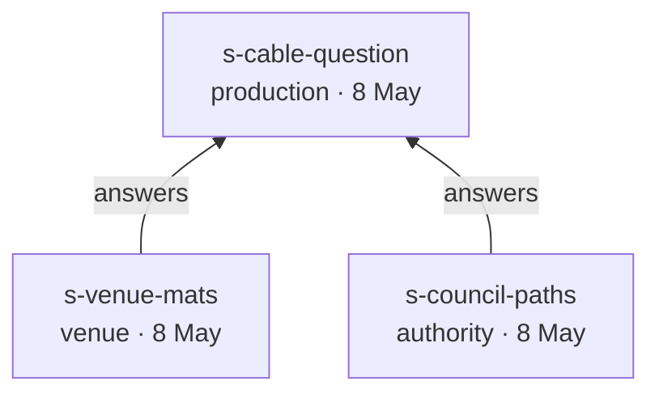

# Example 03 — Second stage, town festival

An outdoor festival stage in a riverside park: four bands, 1500 people, a generator behind the trees, a
lighting rig, an LED wall, and 45 metres between the stage and the sound desk with a public path in
between. All five domains, all four layers, sixty parts and ninety-three connections.

> *"Last year the sound was fine but the stage looked flat on the photos and you couldn't see anything
> after dark."*

A lighting requirement stated as a complaint about photographs. Flatness in a photograph is the absence of
front light at an angle; the client described the symptom, and `r-face-lighting` is the cause. Neither
*key light* nor *front wash* appears anywhere in the brief, and neither ever will.

## Why this example exists

Examples 01 and 02 exercise the language on small, tidy events. This one exists to satisfy **rule 1 of the
verification in `docs/superpowers/specs/2026-08-08-eventml-core-design.md` §7**: every concept defined in
`spec/` or `examples/lib/` must appear in at least one example. After the first two examples, 62 of the library's
172 concepts had never been exercised — every one of them the kind of thing that only turns up on a bigger,
messier job. A festival stage is where they all turn up at once.

Writing it found four real defects in the library, which are fixed in the same commit:

| Defect | Fix |
|---|---|
| Ten `PortDef`s were defined but attached to no `PartDef` at all | Attached to the parts that actually carry them: AES3 and MADI on the DSP, speakON NL8 on the amplifier, a Dante port on the wireless receiver, a secondary port group on the managed switch, a 16 A leg on the RCD, 12G-SDI on the media server, DisplayPort on the scaler, fibre in on the LED processor, NDI out on the camera |
| The video switcher and the abstract processing block had no audio inputs | Added, with `embed` internal edges — a switcher with no audio input cannot stream a talk |
| The abstract image-processing block had no network port | Added, with encode and decode edges |
| The mixing console had no AES3 output, so nothing in the library could feed a system processor digitally | Added `audio.port.xlr3m_aes3` and an `aes_out` port |

That is the two-example rule working as intended: **the examples are the only test v0.1 has, and they found
things.**

## What this adds over examples 01 and 02

| | Where |
|---|---|
| **A flow changing medium three times** | `f-stage-to-foh`: copper → fibre → copper, five connections, one route |
| **Redundancy that is honest about being partial** | `f-stage-to-foh.redundant_over` diverges only at the stage box; the fibre is a single point of failure and the model says so |
| **Two protocols over one cable, one of them dormant** | `f-lighting-sacn` and `f-lighting-backup` over `c-lx-node` |
| **A flow traversing its cables backwards** | `f-rdm-discovery` rides the DMX chain in the opposite direction to `f-dmx-effect` |
| **Power as a flow through parts, not cables** | `f-foh-power` runs distro → cable drum → UPS → console, three hops through parts with sockets |
| **Power over a data connection** | `f-ap-power` carries 48 V DC over `c-ap`, the access point's data uplink |
| **A generator as a source with no inlet** | `gen-1`, whose internal edges start at `engine` |

## The four-layer walk

```
n-flat-photos                             L0  "the stage looked flat on the photos"
  └─refine→  r-face-lighting              L1  lighting.req.face_lighting
               └─satisfy→  key-light      L2  lighting.part.key_light
                             └─allocate→  profile-1  L3  lighting.part.profile_fixture
                             └─allocate→  profile-2  L3  lighting.part.profile_fixture
                                            └─connect→  c-node-p1, c-p1-p2
```

And the control path that drives it, from the desk at front of house to the second fixture:

```
lx-desk ──f-lighting-sacn──▶ node-1 ═sacn_to_dmx═▶ node-1:dmx_out[0]
                                       └──f-dmx-key──▶ profile-1 ═pass═▶ profile-2
```

Fifty metres of sACN carrying three universes, converted to DMX at the stage, then a physical daisy chain
through the first fixture's `dmx_in → dmx_thru` edge. Remove that edge and `profile-2` is unreachable.

## The decisions

`decisions.yaml` carries three. Two of them resolve `n-cable-route`: `d-foh-ground-run`, made on
the site visit itself when the site manager offered cable mats, and `d-foh-catenary`, made twelve days later
once the council's objection had been confirmed as its actual position and could be acted on, which
`supersedes` it. The council representative raised that objection on the same walk-round, in front of the
site manager who had just made the offer — but a remark from one person during a site visit is not yet a
ruling, so the production manager recorded the mats plan that same day on the strength of the offer, and it
took the twelve days that follow to establish that the council meant it and to find a route that satisfied
them. Reading the pair in order shows a plan changing under an external constraint, not a plan that was
always right — mats were the reasonable call on 8 May with only a spoken objection to weigh against the
venue's own suggestion, and flying the link on a catenary is the answer once that objection was confirmed.

`d-foh-catenary` carries `needs_agreement: true` and no `agreed_by`, and it is worth reading closely why.
`s-council-paths` is a prohibition, not a permission: the council representative said no cable may run on
the ground across the path, matted or not, and said nothing whatever about a catenary flown at 5.2 m. The
team solved the problem the council raised — but solving the problem is not the same thing as the council
agreeing to the solution, and nobody went back to ask them. Citing the refusal as if it were consent would
have hidden exactly the gap that matters: the party who can stop the show on the day is the council, not the
client paying for the stage, and the council has not actually been asked. This is also an honest and common
way real projects fail — the objection gets engineered around, the fix looks obviously right to the people
who found it, and closing the loop with the one party whose sign-off counts gets forgotten.

`n-cable-route` itself stays `conflicting`, on purpose. Both statements were made, on the same
site visit, by people with standing to say them; folding the value to `stated` once one side wins would
erase the fact that somebody was overruled, and that fact now lives in `d-foh-catenary` instead. Because
`d-foh-catenary` names `n-cable-route` in `affects`, question rule 4 no longer fires on the
conflict — but because the decision itself is unagreed, rule 7 fires on the decision instead. That handoff
from rule 4 to rule 7, described in prose in `spec/04-uncertainty.md`, is what this decision now
demonstrates: the conflict was never really "which source do we believe", it is "has anyone actually
confirmed the fix with the party who objected" — and until somebody does, the question stays open, just
addressed to the project manager instead of the client.

## The question list

Hand-written, as in the other examples.

```yaml
questions:
  - ask: "Has the headliner's rider arrived? We need the list of radio microphones and in-ear packs — how many of each, and which frequency band they are licensed for."
    why: "brief.program[1].wireless_channels is unknown. Frequency coordination has a lead time and cannot start without it; blocks r-wireless-capacity and the receiver count"
    rule: 1
    source: brief.program[1].wireless_channels
    blocks: 2

  - ask: "The generator was a 20 kVA set last year, before the video screen. Can we confirm the same size is being hired, or check what is available? The screen adds about 2 kW."
    why: "gen-1.rated_kva is assumed. At 14.5 kW measured demand a 20 kVA set is inside the 80% headroom rule, but only just, and the dimmer rack is the largest single-phase load"
    rule: 2
    source: gen-1.rated_kva
    blocks: 2

  - ask: "What is going on the video screen — a camera of whoever is on stage, sponsor loops between bands, or both? If both, does someone need to switch between them live?"
    why: "brief.program[3].content is unknown; r-screen-content has nothing satisfying it and the answer decides whether an operator is needed at all"
    rule: 3
    source: r-screen-content
    blocks: 1

  - ask: "Are the moving heads going in their extended mode or the basic one? Whoever operates them will know — it changes how many control channels they need."
    why: "f-dmx-effect.channels_used is unknown, and lighting.constraint.universe_capacity cannot be checked until it is known. The answer is in the fixtures' GDTF files"
    rule: 1
    source: f-dmx-effect.properties.channels_used
    blocks: 1

  - ask: "d-foh-catenary is unagreed: the council said what was not allowed on the ground, but nobody has gone back to confirm the catenary alternative at 5.2 m with them."
    why: "d-foh-catenary is unagreed; the council can still stop the show on the day if their objection was engineered around rather than actually settled"
    rule: 7
    source: d-foh-catenary
    blocks: 0
    internal: true   # for the project manager, not for the client

  - ask: "r-console-continuity has no recorded origin: nothing anybody said asks for residual current protection, and the reasoning has never been written down."
    why: "non-negotiable on a wet field, and the model cannot justify it — the garden party closes the same gap with a regulation as its source"
    rule: 9
    source: r-console-continuity
    blocks: 0
    internal: true   # for the project manager, not for the client

  - ask: "The brief says the stage is in the park by the river. Does anything about the location itself need designing for — ground, access, the water?"
    why: "n-park is refined by nothing; either a requirement is missing or the location is context rather than a request"
    rule: 8
    source: n-park
    blocks: 0
```

Note the second question. It is rule 2 — an assumption marked `ask: true` — and its `why` does arithmetic
the client will never see: 14.5 kW against a 20 kVA set is 90% of the headroom the model allows. The
question put to the client is about a hire order; the reasoning behind it is a constraint check.

## The thread branches

Three sources form one exchange. The production manager asked, on the walk-round, whether cable could cross
the public path; the site manager said yes with mats, and the council representative, standing there, said
no. Both replies carry `answers: [s-cable-question]`, and both are alternatives of `n-cable-route`.



All three share a date, which the `answer` relation permits: the answered source's date must not be *later*
than the answering one's, and a question put on site is usually answered on the spot. The branch is not an
anomaly to be resolved — it is the disagreement, recorded as it happened, and `d-foh-catenary` is what
settles it.

## A need taken from a rider

`s-headliner-rider` is a source in exactly the sense the client's email is: somebody stated something, and
it is quoted whole. Three needs come out of it — `n-headliner-size`, `n-monitor-mixes` and `n-radio-mics` —
and `r-band-monitoring` refines two of them. The stakeholder here is the act, not the client, which is why
the entity is called a need rather than a client request.

It does not close everything. `brief.program[1].wireless_channels` is still `unknown`, because three of the
four bands have not sent riders and frequency coordination needs the total. One rider arriving is visible
progress against a gap that is still open.
