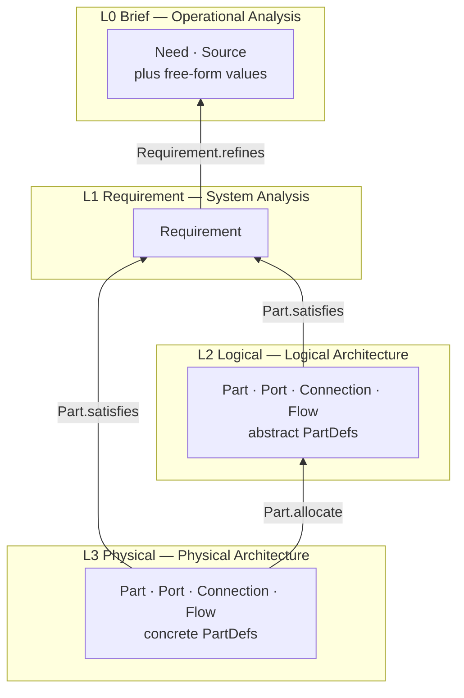

# 01 — Layers

EventML spans four layers, following the [ARCADIA](https://mbse-capella.org/arcadia.html) method. Each layer
answers a different question about the same event, at a different distance from the client's own language.

| Layer | `layer:` value | ARCADIA phase | Content |
|---|---|---|---|
| L0 Brief | `brief` | Operational Analysis | What the client and audience do, in lay language |
| L1 Requirement | `requirement` | System Analysis | What the system must achieve, technology-independent |
| L2 Logical | `logical` | Logical Architecture | Function blocks and signal paths, no technology chosen |
| L3 Physical | `physical` | Physical Architecture | Concrete devices, ports, connections |

The `layer:` value is the literal string written in the header of every YAML file that models something at
that layer. It is written exactly as it appears in the table above: lowercase, singular.

The four layers and the edges between them, drawn so that every arrow points the way the edge is stored —
from the concrete element upward to the abstract one it depends on. This is boundary rule 1 at the end of
this file, seen as a picture: nothing on the diagram points downward.



The `satisfy` edge is drawn from both L2 and L3 because either may carry it; `allocate` is mandatory on every
L3 part and is what keeps the physical design traceable. Four relations are left off: `derive`, which runs from a
requirement to its parent inside L1, and `answer`, which runs from one source to another inside L0, so
neither crosses a boundary; and `trace` and `affect`, which run between a value and a source and between a
decision and anything at all. All four are in `03-relationships.md`.

## L0 Brief

**What belongs here.** Free-form structured values describing what the client and the audience do, in the
client's own terms: attendee counts, schedule items, venue description, stated preferences. This is the
layer closest to the source conversation — a note, an email, a phone call.

**What does not belong here.** Anything phrased as a system property or measured against a technical
standard. L0 records what people do, not what the system must achieve.

**Which entities may appear.** `Source` and `Need`, defined in `02-metamodel.md`, alongside free-form
structured values. No `Part`, no `Connection`, no `Flow` — L0 has no notion of equipment or signal path at
all.

**Worked examples.**

- Well-formed: "300 guests at a garden party on the Gellért terrace, welcome speech at 19:00, live band from
  21:00."
- Belongs in L1 instead: "the room must support simultaneous interpretation into three languages." This is a
  measurable statement of what the system must achieve, not a description of what the client or audience do,
  so it belongs in L1 Requirement.

### Sources and needs

L0 carries two entities no other layer has, both defined in `02-metamodel.md`. A `Source` is one piece of
material of record — an email, a call note, a site visit, a rider, a regulation — quoted rather than
paraphrased. A `Need` is one elementary unit of information taken from a source, still in the stater's own
words, anchored to the passage it came from.

The two levels are why the chain from a cable back to a sentence can be walked and checked. Sources exist
because `trace` needs somewhere to land; needs exist because `refine` needs something to point at. Without
the middle level nothing could show that a request produced no requirement, or that a requirement came
from no request. A paraphrase at either level would break the chain: it puts the modeller's reading of the
brief where the brief itself should be, and the disagreement that surfaces three weeks later has nothing to
be adjudicated against.

```yaml
brief:
  sources:
    - id: s-client-brief
      kind: email
      date: 2026-08-01
      from: client
      subject: "Garden party, 12 September — quote request"
      excerpt: >-
        Hi — we're doing a garden party for about 300 people at the Gellért terrace on 12 September.
        There'll be a welcome speech around 7, then a live band later.

  needs:
    - id: n-audience
      text: "about 300 people"
      src: { id: s-client-brief, exact: "about 300 people", start: 36, end: 52 }
```

**What is not a need.** Values nobody has stated — whether a terrace is covered, how large an audience area
is — are not statements at all. They are questions about the world carrying a provisional answer, and they
keep the place they have in the brief today. Naming them properly is the work of a later release, and the
seam is deliberate rather than an oversight.

## L1 Requirement

**What belongs here.** Statements of what the system must achieve: measurable, technology-independent, each
one traceable back to an L0 element it refines.

**What does not belong here.** Lay narrative of what the client or audience do belongs in L0, not here.
Naming a function block, a signal path, or a device belongs in L2 or L3 — a requirement says what must be
true, never how it is achieved.

**Which entities may appear.** `Requirement` only.

**Worked examples.**

- Well-formed: "in the 200-seat conference room, every delegate must be able to hear the chair without
  leaning forward."
- Belongs in L2 instead: "the PA needs a main hang plus a delay line for the far tables." This names function
  blocks — main PA, delay line — which is a logical architecture decision, so it belongs in L2 Logical.

## L2 Logical

**What belongs here.** Function blocks and their signal paths, with no technology chosen yet: what talks to
what, and over what kind of link, described in terms generic enough to survive a change of manufacturer.

**What does not belong here.** No product names or model numbers — see boundary rule 2 below. No bare
requirement statements without an associated block, and no lay narrative.

**Which entities may appear.** `Part`, `Port`, `Connection`, `Flow` — all referencing technology-neutral
`PartDef`s.

**Worked examples.**

- Well-formed: "the interpretation booth's audio block connects to the delegate receiver block over an RF
  link."
- Belongs in L3 instead: "the main PA is a pair of d&b Y-series tops flown left and right." Naming a
  manufacturer and model is a concrete device choice, so it belongs in L3 Physical.

## L3 Physical

**What belongs here.** Concrete devices, their ports, and the connections between them — the layer that
answers "what do we actually rent and cable."

**What does not belong here.** No function block that lacks an L2 counterpart: every L3 `Part` must trace
back via `allocate` to an L2 `Part` — see boundary rule 3 below. No lay narrative or bare requirements.

**Which entities may appear.** `Part`, `Port`, `Connection`, `Flow` — referencing concrete `PartDef`s, each
`allocate`d from an L2 `Part`.

**Worked examples.**

- Well-formed: "stage box `sb1` connects to the mixer console over Dante on Cat6a, `sb1:dante[0]` to
  `console:dante[0]`."
- Belongs in L2 instead: "an interpretation booth function block sits between the chair mic and the delegate
  receivers." This names a function block with no product attached, so it belongs in L2 Logical.

## Boundary rules

1. **A layer never references downward.** A `Requirement` names neither a block nor a device: it carries
   `refines` and `derived_from` and nothing else. Downward association is expressed by `satisfy` and
   `allocate`, both stored on the lower element — `Part.satisfies` and `Part.allocate` — so every
   traceability edge in the language points from the concrete toward the abstract, with no exception. This
   is what keeps an L1 requirement valid regardless of which L2 or L3 design ends up meeting it, and what
   makes the walk back from a device to the client's own words a chain of field reads.
2. **L2 carries no product names.** If removing the manufacturer would change the meaning of a statement, it
   belongs in L3, not L2 — this is what keeps the logical architecture reusable across different equipment
   choices.
3. **Every L3 `Part` is allocated from exactly one L2 `Part`.** An unallocated L3 part is a modelling error
   rather than an open question — a device has appeared in the plan that no logical decision called for, and
   it needs fixing, not asking. This is what keeps the physical design traceable back to a logical decision
   instead of appearing out of nowhere.
