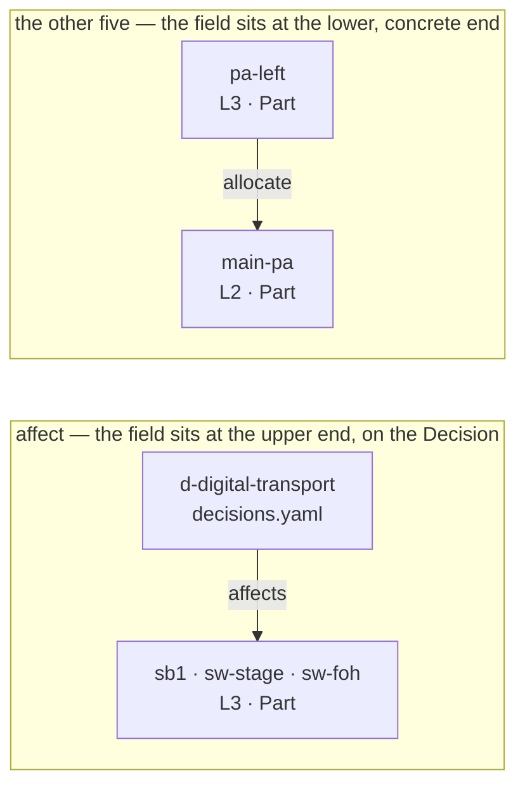
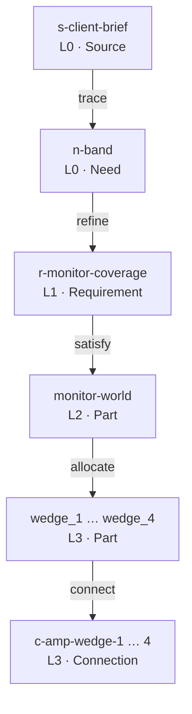

# 03 — Relationships

Seven relations connect the four layers and the entities within them. Between them they answer one question:
for any statement in the model, where did it come from and what depends on it.

| Relation | Direction | Carried by | Meaning |
|---|---|---|---|
| `refine` | L0 → L1 | `Requirement.refines` | A stakeholder statement becomes a requirement |
| `derive` | L1 → L1 | `Requirement.derived_from` | A requirement decomposes into sub-requirements |
| `satisfy` | L2/L3 → L1 | `Part.satisfies` | This block or device meets that requirement |
| `allocate` | L2 → L3 | `Part.allocate` | A logical block is realised by a concrete device |
| `trace` | any → L0 source | `Value.src`, `Need.src` | Which statement, PM decision or default |
| `answer` | L0 → L0 | `Source.answers` | This communication responds to that one |
| `affect` | Decision → any | `Decision.affects` | A decision determined this element |

None of the seven is a standalone entity. Six are attributes on the element at the lower end of the edge — the
requirement knows which brief element it refines, the device knows which block it realises, the block knows
which requirement it meets — and that placement is what boundary rule 1 in `01-layers.md` requires: a layer
never references downward, so an L1 requirement stays valid no matter which L2 or L3 design ends up meeting
it. `affect` is the seventh, and it is a deliberate exception rather than an oversight: `affects` sits on the
`Decision`, at the upper end of its edge, not on the elements it determines. The `affect` section below gives
the reasons.

The lower-end rule has a consequence worth stating plainly, because it is what makes the model readable
backwards. Every one of the six edges points from the concrete toward the abstract, so tracing *back* from a
cable to the sentence that caused it is a chain of field reads — `allocate`, then `satisfies`, then
`refines`, then `src` — with no search at any step. Tracing *forward*, from a client sentence to the
equipment it produced, is the direction that requires a scan. That asymmetry is deliberate: the backward
question is the one asked under pressure, on site, about a device somebody is holding. `affect` is the one
edge on that walk which cannot be followed this way: reaching from an element to the decision that determined
it means scanning `decisions.yaml` for an `affects` entry that names it, not reading a field.

Two of the seven stay inside one layer. `derive` decomposes a requirement within L1; `answer` connects one
communication to another within L0. Neither crosses a boundary, and neither appears on the layer diagram in
`01-layers.md` for that reason.

`trace` is the one relation that is layer-independent. A value in `physical.yaml` names a source in L0 as
readily as a brief value does, because a source is material of record rather than a design element, and
what caused a choice does not become less relevant three layers down. This is not an exception to boundary
rule 1: that rule forbids a layer from naming elements *below* it, and L0 is above everything.

The worked examples throughout this file use one scenario: a garden party for 300 on a terrace, with a
welcome speech at 19:00 and a live band from 21:00, where nobody has yet said how many musicians there are.

## refine

**YAML form.** `Requirement.refines`, holding the ids of the `Need`s it refines.

```yaml
- id: r-speech-terrace
  def: audio.req.speech_intelligibility
  params:
    area: "the terrace seating area"
    audience: 300
  refines: [n-welcome-speech, n-audience]
```

**Cardinality.** Many-to-many. A requirement refines any number of needs, and a need may be refined by many
requirements — "then a live band later" produces a requirement for amplification, one for monitoring, and
one for stage power.

A requirement is assembled from more than one statement. The example above answers what the client said
about the speech and takes its headcount from what they said about numbers, and it names both. Which of the
two was the reason the requirement exists, and which merely supplied a figure, is not recorded — that is
read from the requirement's own text, and reading a requirement is work for a person or an agent. The edge
carries what a check can decide.

**Every requirement names its origin.** It refines a need, it derives from another requirement, or it does
both — `r-coverage-uniformity` in `examples/01-garden-party` is a technical consequence of speech
intelligibility and an answer to what the client said about the speech. What cannot happen is neither.

**When the edge is absent.** On a derived requirement that is correct and needs no comment: it inherits its
origin from its parent. On a requirement carrying no `derived_from` either, the origin has not been
recorded, and question rule 9 in `04-uncertainty.md` reports it.

An earlier draft of this file called that state something else, and the correction is worth stating.
Nobody asks for a residual current device, and it is tempting to conclude that such a requirement has no
origin. It has one: a wiring regulation, which is a source. A requirement resting on professional judgement
has one too — us, stating the judgement, which `from: production` already records. So an absent `refines`
does not mean the requirement came from nowhere. It means nobody wrote down where it came from, and the
client is being asked to pay for a line the model cannot justify.

## derive

**YAML form.** `Requirement.derived_from`, holding the id of the parent requirement.

```yaml
- id: r-band-monitoring
  def: audio.req.performer_monitoring
  params:
    performers: { state: unknown }
  derived_from: r-band-amplification
```

**Cardinality.** One requirement derives from zero or one parent. A parent may have many children. The
result is a forest, not a graph: decomposition is a tree, and a requirement with two parents is a modelling
error that means one of the two edges is really a `satisfy` in disguise.

**When the edge is absent.** The requirement is a root: it came straight from a stakeholder statement via
`refine`, or its origin has not been recorded at all. Root requirements are the ones worth reading to a
client; derived ones are usually technical consequences the client does not need to see.

## satisfy

**YAML form.** `Part.satisfies` on the L2 or L3 part, holding a list of `Requirement` ids.

```yaml
# L2 — the logical blocks that meet the speech requirement
- id: main-pa
  def: audio.part.main_pa
  layer: logical
  satisfies: [r-speech-terrace]

- id: delay-line
  def: audio.part.delay_line
  layer: logical
  satisfies: [r-speech-terrace]
```

**Cardinality.** Many-to-many. One requirement may need several parts to meet it — a speech is intelligible
because of the main hang *and* the delay line — and one part may satisfy several requirements, which is what
makes a piece of equipment worth its truck space.

**Where SysML v2 puts it.** On the satisfying element, not on the requirement: `part def Drone { satisfy
requirement : CargoCapacity; }` binds the requirement's subject to the enclosing part. The standalone form,
`satisfy R1 by vehicle;`, names both ends explicitly. In neither does the requirement hold a list of the
things that meet it, and EventML follows the standard here — see `06-sysml-mapping.md`.

**When the edge is absent.** Read from the requirement's side, nothing in the design meets it yet. That is
not a modelling error; it is the normal state of a requirement captured but not yet designed for, and it is
exactly what question rule 3 in `04-uncertainty.md` fires on. A model is expected to hold requirements in
this state, sometimes for weeks.

Read from the part's side, a part with no `satisfies` is a block or device that nothing in the model asks
for. On an L3 part this is usually harmless, because the requirement is met by the L2 block it is allocated
from and the edge sits there. On an L2 part it is worth attention: a logical block no requirement calls for
is either unnecessary, or evidence of a requirement nobody wrote down.

## allocate

**YAML form.** `Part.allocate` on the L3 part, holding the id of the L2 part it realises.

```yaml
# L2 — the logical block
- id: main-pa
  def: audio.part.pa_system
  layer: logical

# L3 — the devices realising it
- id: pa-left
  def: audio.part.line_array_top
  layer: physical
  allocate: main-pa

- id: pa-right
  def: audio.part.line_array_top
  layer: physical
  allocate: main-pa
```

**Cardinality.** Every L3 part allocates from exactly one L2 part; one L2 part may be realised by many L3
parts. This is boundary rule 3 in `01-layers.md`.

**When the edge is absent.** An L3 part with no `allocate` is a modelling error, not an open question: a
device has appeared in the plan that no logical decision called for. In practice it means either that the
device is genuinely unnecessary, or — more often — that a logical block was skipped and the reasoning behind
the device was never written down. Either way it needs fixing rather than asking.

## trace

**YAML form.** `src` inside a value wrapper, naming an entry in the brief's `sources` list. The wrapper is
defined in `04-uncertainty.md` and the source entry in `01-layers.md`; here only the `src` attribute matters.

```yaml
brief:
  sources:
    - id: s-site-visit
      kind: site_visit
      date: 2026-08-04
      from: production
      sender: "technical contact, venue"
      excerpt: >-
        Confirmed the CEE outlet by the service door — 32 A three-phase, on its own RCD.

  audience: 300                       # bare scalar: stated, source is the brief itself
  venue:
    covered:
      value: false
      state: assumed
      why: "the brief says 'terrace'; no marquee mentioned"
      ask: true
    power_available:
      value: "32 A three-phase"
      state: stated
      src: s-site-visit
```

**Cardinality.** Every non-`stated` value carries one `src` or one `why`, depending on its state. A single
source may be traced to by any number of values — one site visit answers a dozen questions.

**A `Need` carries the same edge, at finer granularity.** Its `src` names not only the source but the
passage within it, using both selectors the W3C Web Annotation Data Model defines for text — the quoted
string and the character offsets. The redundancy is the point: the quotation survives an edit that shifts
every offset in the file, the offsets stay exact where the same sentence occurs twice, and where the two
disagree the break is visible instead of silent.

```yaml
needs:
  - id: n-load-in
    text: "Load-in from 14:00 at the earliest"
    src: { id: s-venue-call, exact: "Load-in from 14:00 at the earliest", start: 96, end: 130 }
```

A value's `src` still names a source, exactly as in v0.1. The finer form above is the need's own anchor
into the passage it was taken from, not a new way of writing a value's provenance.

**When the edge is absent.** For a `stated` value written as a bare scalar, absence is correct: the source is
the brief document itself, and repeating that on every line would be noise. For any other state, a missing
`src` or `why` means the model has lost the reasoning behind a value, and the next person to read it cannot
tell an assumption from a fact. That is the failure mode `trace` exists to prevent.

## answer

**YAML form.** `Source.answers`, holding the ids of the earlier sources this one responds to.

```yaml
- id: s-client-confirm
  kind: email
  date: 2026-08-12
  from: client
  subject: "Re: Garden party, 12 September — guest numbers"
  answers: [s-audience-query]
  excerpt: >-
    Yes, plan for 450. Sorry for the back and forth — the list is final now.
```

**Cardinality.** One `answers` entry relates exactly one answering source to exactly one answered source. A
source may carry any number of them, and may be named by any number of later sources; most sources carry
none at all. Stating it this way rather than as a many-to-many relation is deliberate: an edge that is a
fact of its own has somewhere to carry an assessment of the answer later, which a set-valued attribute does
not.

**The thread is derived, not stored.** Where two parties answer the same question the thread branches, and
where one message answers two questions it merges. Both fall out of the edges. EventML names no "thread",
just as it stores no requirement tree behind `derived_from`.

**It is not the mail client's reply-to.** A message that is a reply but answers nothing carries no edge —
the relation records that a question was answered, not that a message followed another. And an answer may
arrive by a different channel from the question: we write, the client telephones. No mail thread can
express that, and it is why the edge exists rather than being left to the mail server.

**Our own question is a source.** `from: production` already admits it, and a site visit is such a source
today. Nothing in this relation waits on the machinery that composes an outbound question and tracks its
state; that is a later release.

**It changes no value.** When "Yes, plan for 450" arrives, the audience need stays `conflicting`. Both
statements were made, and which one prevailed belongs to a `Decision` — this is rule 4's exception in
`04-uncertainty.md`, applied to the same facts. Values move only through the state machinery.

**Time.** Every source carries a date, and the answered source's date must not be later than the answering
one's. An edge pointing forward in time is a failed check rather than a question, and the constraint rules
out cycles. Same-day is ordinary: a question put during a site visit is often answered on the spot, and
`examples/03-festival-stage` carries that case.

**When the edge is absent.** Nothing responded to this source, or nothing it responded to was recorded. A
question we sent that nothing answers is worth surfacing, and becomes derivable from this edge — but the
rule that fires on it belongs with the question lifecycle, in a later release.

## affect

**YAML form.** `Decision.affects`, holding a list of instance ids and brief paths.

```yaml
- id: d-digital-transport
  date: 2026-08-14
  by: { party: production, person: "system engineer" }
  decision: "Stage inputs reach front of house as Dante over Cat6a, not as an analogue multicore."
  why: "sixteen channels the length of the terrace, and a load-in that cannot start before 14:00"
  alternatives:
    - { option: "16-way analogue multicore", why_not: "weight, and too short a load-in window to run it out" }
  affects: [sb1, sw-stage, sw-foh]
  src: s-venue-call
```

**Cardinality.** Many-to-many. One decision may determine several elements; one element may be determined by
several decisions.

The placement is easiest to see next to an ordinary relation. In both halves below, the arrow runs from the
element that holds the field to the element the field names; only in `affect` does it run from the abstract
record down to the concrete elements it determined.



Reaching from `pa-left` to the block it realises is a field read. Reaching from `sb1` to the decision that
put it in the plan is a scan of `decisions.yaml` for an `affects` entry that names it.

**Why it sits on the decision.** Two reasons, stated plainly:

- A record must read as a record. A decision whose scope is split across five files cannot be reviewed, and
  reviewing it is the entire purpose of keeping it.
- The backward scan is bounded. Moving `satisfy` in v0.1 avoided scanning 37 requirements; the recording
  criterion in `07-decisions.md` holds decisions to roughly ten per project, and scanning ten entries costs
  nothing.

The second reason is also a check on the first: if a project accumulates as many decisions as requirements,
the fault lies in the recording rather than in the relation.

**Containment.** An `affects` entry covers the element it names and every value inside it. Naming a
requirement reaches the parameters within it; naming a part reaches its properties. Enumerating every
nested value instead would make the lists long, fragile, and wrong the moment an element gained a field.
`04-uncertainty.md` relies on this where rule 4 stops firing on a conflict a decision has settled.

**When the edge is absent.** A decision with no `affects` determined nothing, which means it is not a
decision. Unlike the other relations, an empty `affects` is a modelling error rather than a question.

**`supersedes`.** Unlike `affects`, it obeys the ordinary rule. It sits on the newer decision, so walking a
decision's history backward stays a field read.

## Traversal

These relations chain into one path from a sentence in a client's email down to a cable. Following the
band from the garden-party brief:



Nobody has said how many musicians are in the band. That one sentence at L0 — and the unknown hanging off
it — refines into a requirement for monitor coverage, which is satisfied by a logical monitor world, which is allocated to four wedges,
which are connected to an amplifier. Every element below the unknown is provisional: four wedges is a guess
that follows from a guess about the band's size.

The diagram reads downward, but every edge on it is stored at its lower end, so the chain is walked upward
by reading one field at a time. Standing on site holding a wedge, the walk back to the client's own words is
four reads and no searching:

```
wedge_1            .allocate  → monitor-world        (L3 → L2)
monitor-world      .satisfies → r-monitor-coverage   (L2 → L1)
r-monitor-coverage .refines   → n-band               (L1 → L0)
n-band             .src       → s-client-brief, "then a live band later"
```

This is the only traversal v0.1 supports without a scan, and it is deliberately the one that matters when
somebody asks why a piece of equipment is on the truck. The opposite direction — from a brief sentence
forward to everything it caused — has no stored edge to follow and requires examining every part in the
model. `04-uncertainty.md` needs exactly that direction to compute `blocks`, which is one reason the
question list is hand-written in v0.1.

**The rule that makes the language pay off: any node on this chain that is missing, unknown or unsatisfied
propagates upward into a question, and the number of requirements downstream of it is its rank.** The band's
size is not one question among forty. It is the question that decides monitor count, monitor mixes, input
count, stage box size and stage power — and the model knows that, because those requirements are reachable
from it by following `refine`, `derive` and `satisfy` edges. Counting them is what turns a flat list into
"these three questions decide half the plan".

`04-uncertainty.md` sets out the five conditions that generate a question and how the count is computed.
